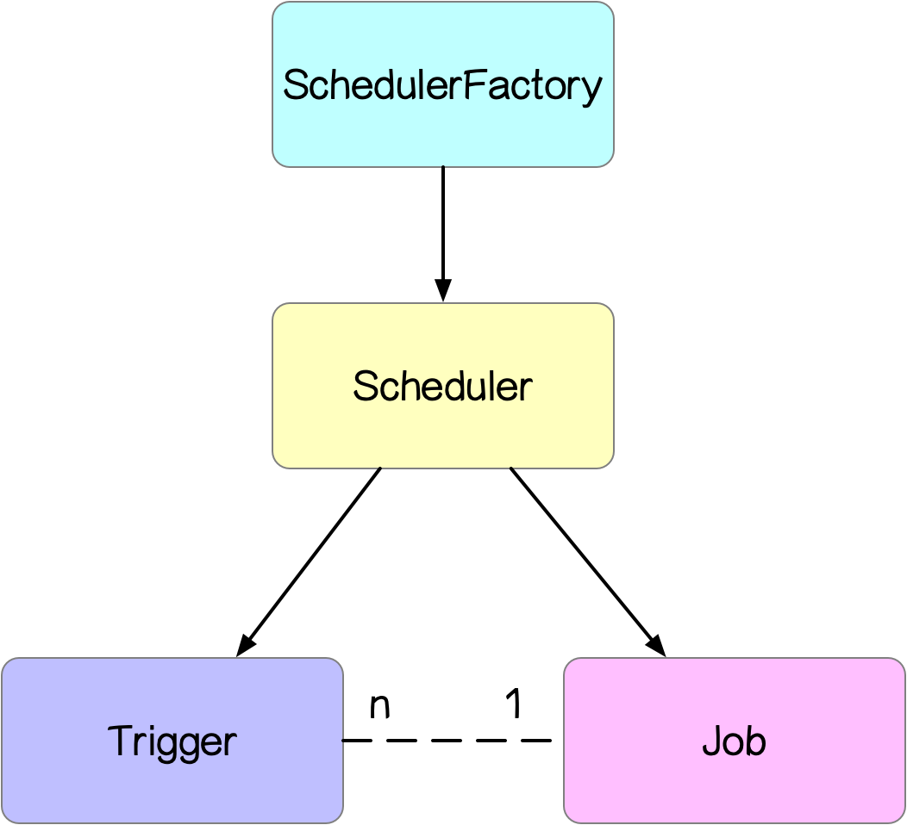
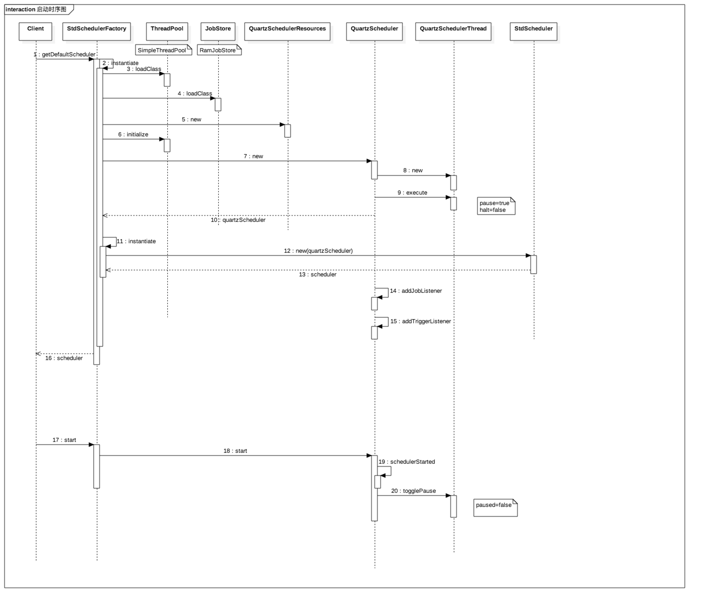
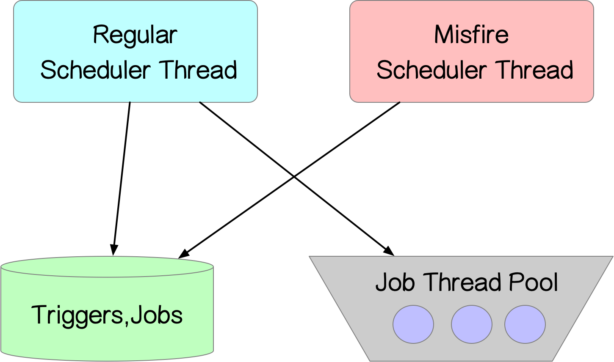
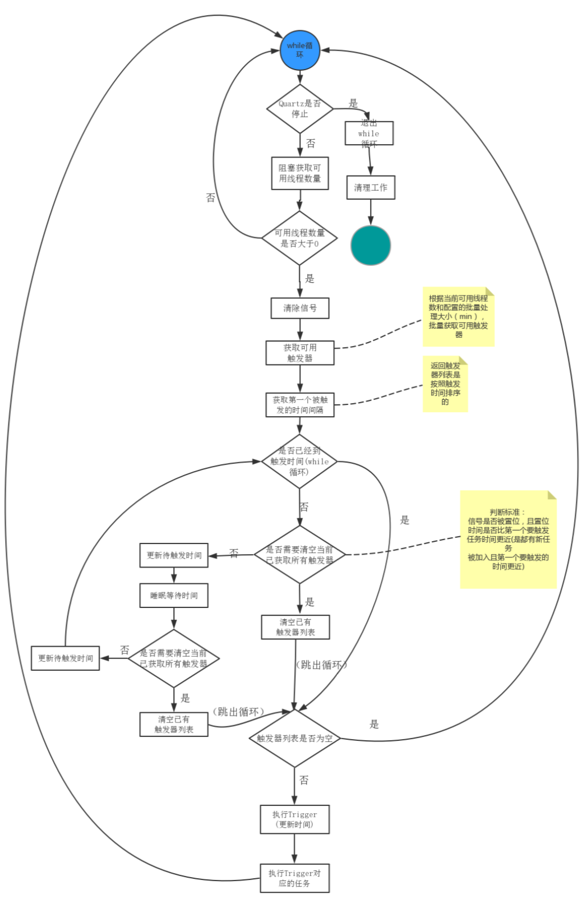
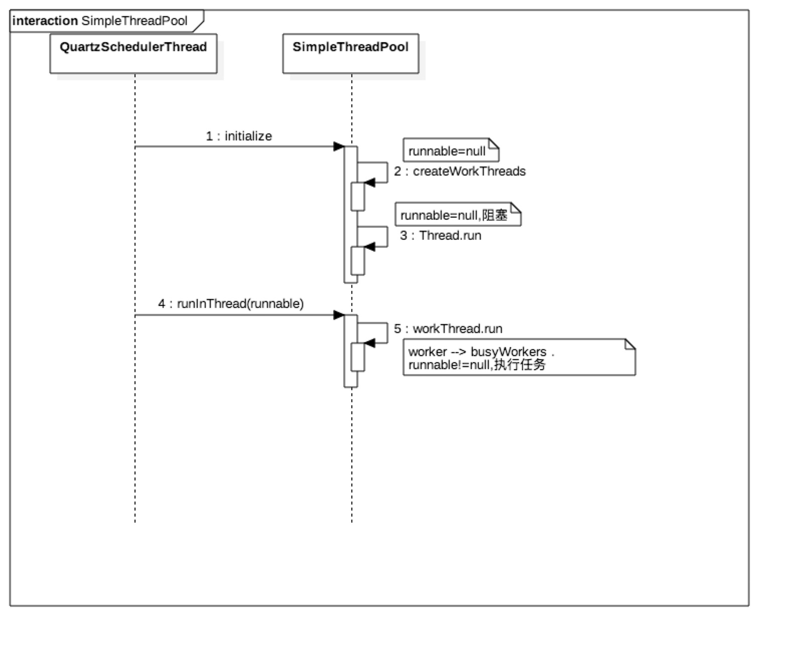
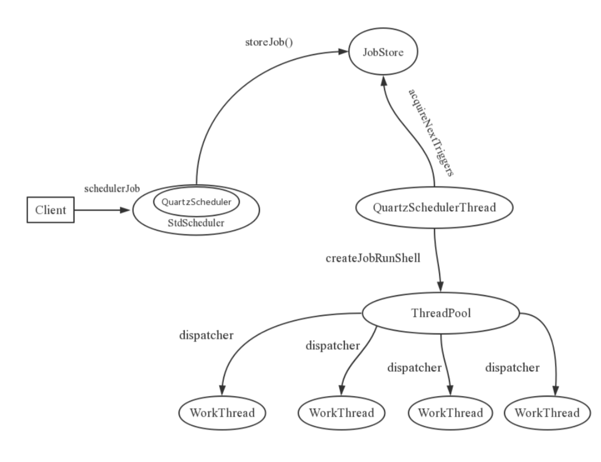
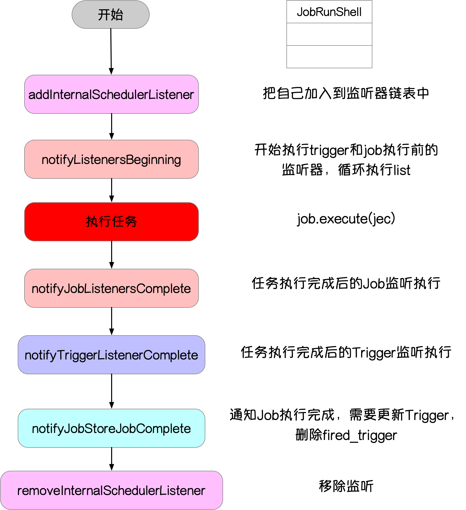
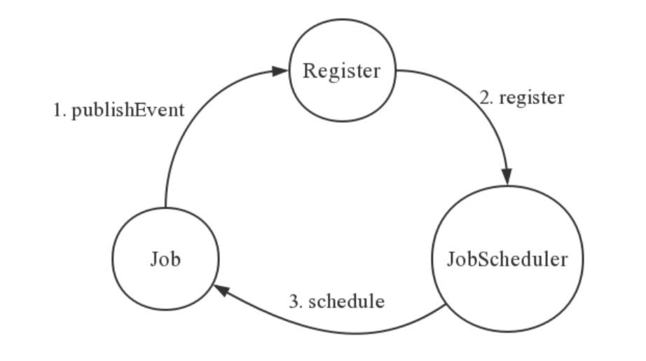
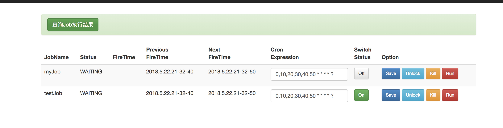

> 本文出处：http://beautyboss.farbox.com/post/dts/quartzfen-xiang
### 背景

这是去年(18年)6月份在团队内部做的一个Quartz分享，记录在[原来的博客](http://beautyboss.farbox.com/)上，现同步到新的博客上。

### What

#### 简单介绍

Quartz是由OpenSymphony公司开源的一个定时任务调度框架，完全由Java开发。有以下的特点:

1. 强大的调度功能。支持丰富多样的调度方法，可以满足各种常规及特殊需求。
2. 灵活的应用方式。支持任务和调度的多种组合方式，支持调度数据的多种存储方式。
3. 分布式和集群能力。
4. 容易与其他框架集成，使用简单。

Quartz支持几乎以下所有的触发方式

- 在一天中的任意时刻（可以精确到毫秒）。
- 一周中特定的一些天。
- 一个月中特定的一些天。
- 一年中特定的一些天。
- 不在日历列表中注册的一些天（比如节假日）。
- 循环特定的次数。
- 无限循环。
- 按照一定的时间间隔循环。 
#### 核心元素

1. `Scheduler`:任务调度器，是实际执行任务调度的控制器，常用的有`StdScheduler`。

2. `SchedulerFactory`:`Scheduler`工厂类，用来生成`Scheduler`,有`DirectSchedulerFactory`和`StdSchedulerFactory`两种，常用的是`StdSchedulerFactory`。

3. `Trigger`:触发器，用于定义任务调度的时间规则，有：

   - `SimpleTrigger`：指定从某一个时间开始，以一定的时间间隔（单位是毫秒）执行任务。它适合的任务类似于：9:00 开始，每隔1小时，每隔几分钟，每隔几秒钟执行一次。
   - `CalandarIntervalTrigger`：类似于`SimpleTrigger`，指定从某一个时间开始，以一定的时间间隔执行任务。 区别：`SimpleTrigger`只支持时间间隔的单位为ms，`CalandarIntervalTrigger`支持的间隔单位有秒，分钟，小时，天，星期，月，年。不用自己去转换成毫秒。支持不是固定长度的间隔。比如间隔为月和年。缺点是经度只能支持到秒。
   - `DailyTimeIntervalTrigger`：指定每天的每个时间段内，以一定的时间间隔执行任务，并且可以支持指定星期。
   - `CronTrigger`。支持cron表达式。
   - `NthIncludedDayTrigger`：每一间隔类型的第几天执行任务。

4. `Job`:是一个接口，开发者自定义的任务只需要实现这个接口，接口只有一个方法`void execute(JobExecutionContext context);`。
   `JobExecutionContext`提供了调度上下文的各种信息。
   有两种类型的`Job`:无状态(stateless)的和有状态(stateful)，默认是无状态的，需要用`@DisallowConcurrentExecution`注解变成有状态的。
   对同一个`Trigger`来说，有状态的任务不能被并行，只有上一次被触发的任务执行完成之后才可以执行。
   `Job`主要有两种属性：`volatility`和`durability`，其中`volatility`表示任务是否被持久化到数据库存储，而`durability`表示在没有`trigger`关联的时候任务是否被保留。两者都是在值为 true 的时候任务被持久化或保留。
   一个`job`可以被多个`trigger`关联，但是一个`trigger`只能关联一个`job`。
   

5. `JobDetail`:用来描述`Job`实现类及其相关的静态信息`Job`名字、
   实现类，关联监听器等信息。`Job`运行时的数据保存在`JobDataMap`中。

6. `Calendar`:它是一些日历特定时间点的集合。一个`Trigger`可以包含多个`Calendar`，以便排除或包含某些特定时间点。

7. `JobStore`:`JobStore`负责保存跟踪所有提交给`Scheduler`的数据，包括`Jobs`、`Triggers`、`Calendar`等。`Quartz`中包含两种`JobStore`:

   - `RAMJobStore`:数据保存在内存中，速度快，但是不能持久化，应用结束之后数据丢失。
   - `JDBCJobStore`:数据保存在数据库中，数据不会丢失。速度比`RAMJobStore`慢，配置复杂。 ` org.quartz.jobStore.class: org.quartz.simpl.RAMJobStore `

8. `Misfire`

   1. 定义 当一个持久的触发器因为调度器被关闭或者线程池中没有可用的线程而错过了机会时间，就被称为触发失败(misfire)。

   2. 如何判定。 配置文件(quartz.properties)中会配置一个`misfire threshold`，默认是60s，如果一个任务超时时间超过这个配置的值，则认为`misfire`。比如: 一个定时任务，从13:07:24开始执行，每隔3s执行一次， 13:33:36 13:33:39 13:33:42 13:33:45 13:33:48 13:33:51 第一次执行时间为11s 13:33:36 --> 13:33:47,跟换计划的13:33:39相差8s misfireThreshold <= 8 --> misfire **任务的延时是会累加的。**

   3. 如何处理。
      `MisfireInstructions`告诉`Scheduler`如何处理`misfire`任务，不同的`Trigger`处理规则不同,默认是`Trigger.MISFIRE_INSTRUCTION_SMART_POLICY`。

      1. `CronTrigger`

         - `withMisfireHandlingInstructionIgnoreMisfires`:所有`misfire`的任务会马上执行。
         - `withMisfireHandlingInstructionDoNothing`:所有的`misfire`不管，执行下一个周期的任务。
         - `withMisfireHandlingInstructionFireAndProceed`:会合并部分的`misfire`，正常执行下一个周期的任务。

         假设一个任务，周一至周五上午9点~18点，每隔一个小时执行一次，8:30点系统挂了，10:15恢复，则9点、10点的misfire了。
         - `withMisfireHandlingInstructionIgnoreMisfires`:9点，10点的misfire都会被立马执行。
         - `withMisfireHandlingInstructionDoNothing`:忽略
         - `withMisfireHandlingInstructionFireAndProceed`:9点10点的合在一起，只会执行一次。
         - `SimpleTrigger`
9. 为什么要使用`JobDetail`而不是直接使用`Job`

### How

```
  public class HelloJob implements Job{

    @Override
    public void execute(JobExecutionContext context) throws JobExecutionException {
        JobDetail jobDetail = context.getJobDetail();
        String param = jobDetail.getJobDataMap().getString("param"); // 从JobDataMap中获取数据
        System.out.println(">>>>>>>> param:" + param);
    }

}
public class Main {

    public static void main(String[] args) throws SchedulerException, InterruptedException {

        // 1. 创建Scheduler
        Scheduler scheduler = StdSchedulerFactory.getDefaultScheduler();

        // 2. 创建JobDetail
        JobDetail jobDetail = newJob(HelloJob.class) // 定义job类真正的执行类
                .withIdentity("JobName","JobGroup") // 定义name/group
                .usingJobData("param","Hello World") // 定义属性，保存在JobDataMap中
                .build();

        // 3. 创建Trigger,定义触发规则
        Trigger trigger = newTrigger()
                .withIdentity("CronTriggerName","CronTriggerGroup")
                .withSchedule(CronScheduleBuilder.cronSchedule("*/5 * * * * ?")) //  cron表达式，每5s执行一次
                .startNow() // 一旦加入scheduler，立即生效
                .build();

        // 4. 把job和trigger注册到Scheduler中
        scheduler.scheduleJob(jobDetail,trigger);

        // 5. 启动调度器
        scheduler.start();

        Thread.sleep(100000);

        // 6. 停止调度
        scheduler.start();
    }
}
```

### Why

#### 几个核心类

##### `Scheduler`

接口，定义了`Quartz`中调度器的重要功能。

##### `StdScheduler`

最常用的`Scheduler`,实现了`Scheduler`接口由`StdSchedulerFactory.getDefaultScheduler()`方法获取，在这个过程中，间接的调用了`instantiate()`方法，这个方法完成了框架所有组件的创建和初始化。

##### `QuartzScheduler`

`QuartzScheduler`中封装了对框架的大部分操作,`StdScheduler`中所有的方法都是调用`QuartzScheduler`中的方法的实现。

##### `QuartzSchedulerThread`

继承自`Thread`，是`Quartz`的心脏，它的`run()`方法是整个调度的核心，在`run()`方法中会循环去`JobStore`中查找最早执行的`trigger`，并异步的执行对应的任务。

##### `JobRunShell`

继承自`Runnable`，它是对一个需要执行的`job`实现类的封装， 在`QuartzSchedulerThread#run`方法创建，并调用线程池中的线程去执行，在它的`initialize(QuartzScheduler sched)`方法中，用反射生成了`job`类，`run`方法是一个job被执行的逻辑。

##### `SimpleThreadPool`

是默认的线程池，它有一个内部类`WorkerThread`继承自`Thread`，每一个`WorkerThread`类代表线程池中的一个线程。通过`SimpleThreadPool#runInThread`方法提供异步处理。

##### `QuartzSchedulerResources`

这个类保存了所有的运行时资源，包括`ThreadPool`，`JobStore`等。

##### `JobStore`

给`QuartzScheduler`提供了`Job`和`Trigger`的存储机制，默认使用`RAMJobStore`，数据保存在内存中，配置了数据库时，所有的数据库操作封装在了`JobStoreSupport`中。

#### `Quartz`启动时序图



#### 线程模型

`Quartz`中有两类线程:`Scheduler`调度线程和任务执行线程。其中任务执行线程是个线程池。
`Scheduler`调度线程有两类: 执行常规调度的线程，和执行misfired trigger(JDBCJobStore才有)的线程。



#### `QuartzSchedulerThread`

`QuartzSchedulerThread`是`Scheduler`的核心，是一个单独的线程，不断轮询查找下次待执行的任务，并把任务交给任务执行线程去执行。



#### `SimpleThreadPool`





#### `JobRunShell`

`JobRunShell`是对要执行的`Job`的封装，由`SimpleThreadPool`执行。



#### `RAMJobStore`(看代码)

### Practise

基于`Quartz`实现一个简单的任务调度系统。



#### `AmQuartzJob`注解

```
@Target({ElementType.TYPE})
@Retention(RetentionPolicy.RUNTIME)
@Documented
@Component
public @interface AmQuartzJob {

    String name(); // job名称

    String group() default "DEFAULT";

    String cronExp(); // cron表达式

    String type() default "single"; // 执行类型
}
```

#### `ClusterJob`

```
public abstract class ClusterJob extends QuartzJobBean implements StatefulJob,InterruptableJob,ApplicationContextAware,InitializingBean {
  protected abstract void clusterExecute(JobExecutionContext context) throws JobExecutionException;
}
```

#### `demo`

```
@AmQuartzJob(name = "testJob",cronExp = "0,10,20,30,40,50 * * * * ?")
public class TestJob extends ClusterJob{

    @Override
    protected void clusterExecute(JobExecutionContext context) throws JobExecutionException {
        System.out.println(">>>>>>>> Hello World");
    }

}
```

