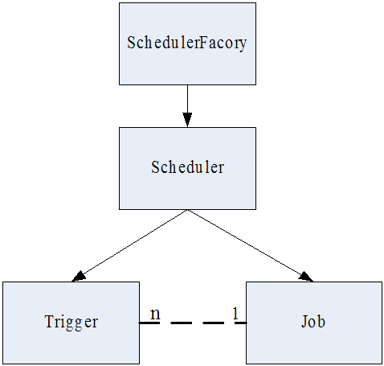
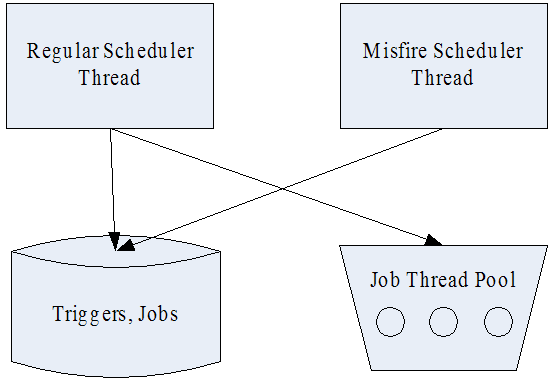
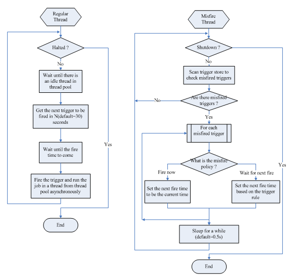
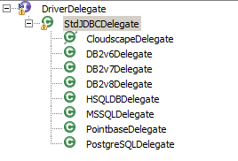
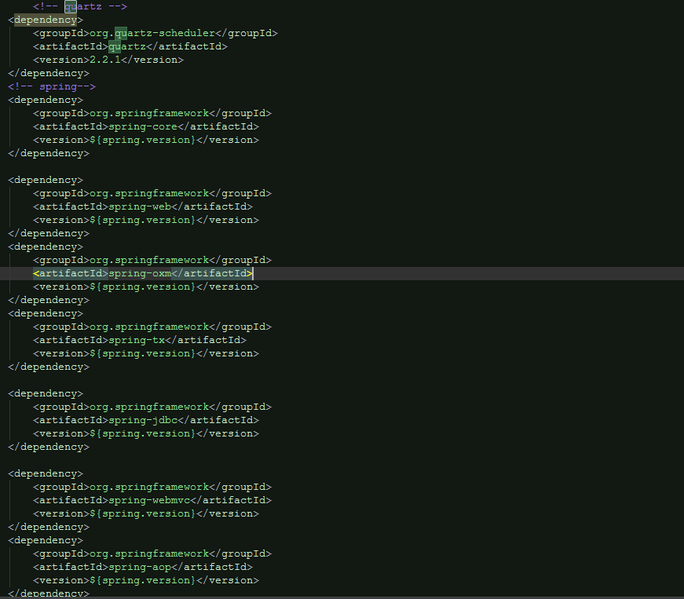
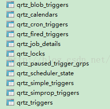
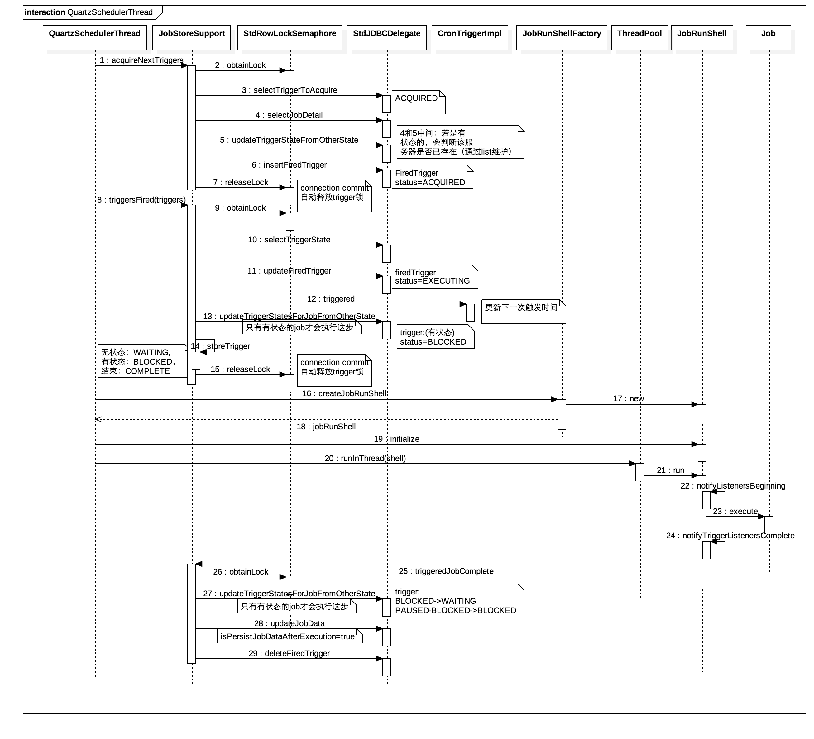
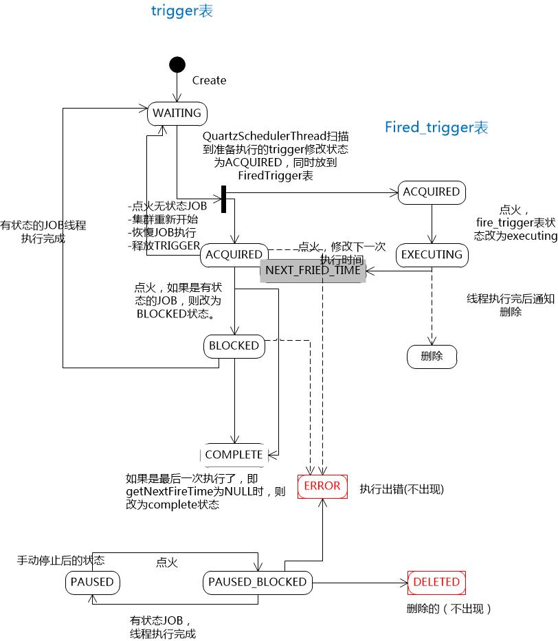
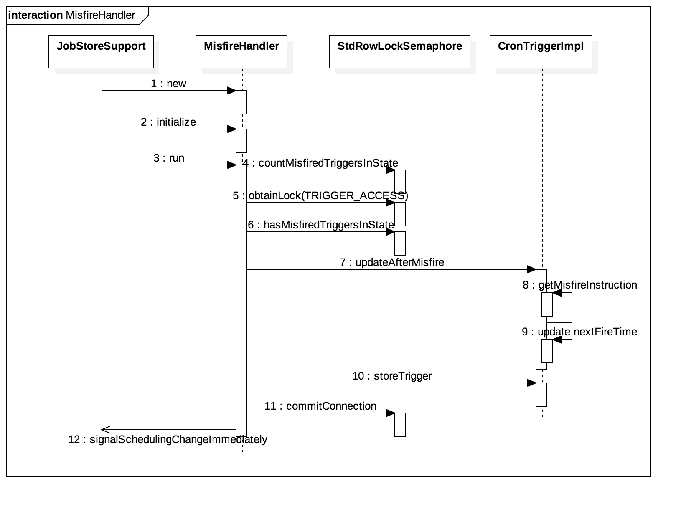
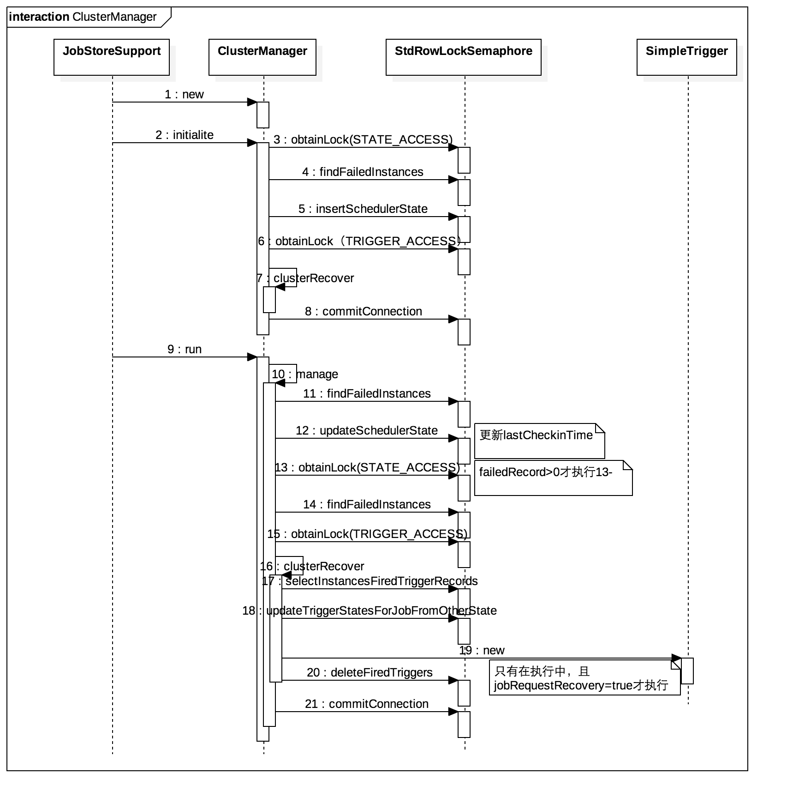

> 本文出处：https://my.oschina.net/songhongxu/blog/802574

# 一、Quartz 基本介绍

## 	1.1 Quartz 概述

　　Quartz 是 OpenSymphony 开源组织在任务调度领域的一个开源项目，完全基于 Java 实现。该项目于 2009 年被 Terracotta 收购，目前是 Terracotta 旗下的一个项目。读者可以到 http://www.quartz-scheduler.org/站点下载 Quartz 的发布版本及其源代码。

## 	1.2 Quartz特点

作为一个优秀的开源调度框架，Quartz 具有以下特点：

1. 强大的调度功能，例如支持丰富多样的调度方法，可以满足各种常规及特殊需求；
2. 灵活的应用方式，例如支持任务和调度的多种组合方式，支持调度数据的多种存储方式；
3. 分布式和集群能力，Terracotta 收购后在原来功能基础上作了进一步提升。

另外，作为 Spring 默认的调度框架，Quartz 很容易与 Spring 集成实现灵活可配置的调度功能。

**quartz调度核心元素**：

1. Scheduler：任务调度器，是实际执行任务调度的控制器。在spring中通过SchedulerFactoryBean封装起来。
2. Trigger触发器，用于定义任务调度的时间规则，有SimpleTrigger,CronTrigger,DateIntervalTrigger和NthIncludedDayTrigger，其中CronTrigger用的比较多，本文主要介绍这种方式。CronTrigger在spring中封装在CronTriggerFactoryBean中。
3. Calendar：它是一些日历特定时间点的集合。一个trigger可以包含多个Calendar，以便排除或包含某些时间点。
4. JobDetail：用来描述Job实现类及其它相关的静态信息，如Job名字、关联监听器等信息。在spring中有JobDetailFactoryBean和 MethodInvokingJobDetailFactoryBean两种实现，如果任务调度只需要执行某个类的某个方法，就可以通过MethodInvokingJobDetailFactoryBean来调用。
5. Job：是一个接口，只有一个方法void execute(JobExecutionContext context),开发者实现该接口定义运行任务，JobExecutionContext类提供了调度上下文的各种信息。Job运行时的信息保存在JobDataMap实例中。实现Job接口的任务，默认是无状态的，若要将Job设置成有状态的，在quartz中是给实现的Job添加@DisallowConcurrentExecution注解（以前是实现StatefulJob接口，现在已被Deprecated）,在与spring结合中可以在spring配置文件的job detail中配置concurrent参数。

## 1.3 Quartz 集群配置

　　quartz集群是通过数据库表来感知其他的应用的，各个节点之间并没有直接的通信。只有使用持久的JobStore才能完成Quartz集群。
数据库表：以前有12张表，现在只有11张表，现在没有存储listener相关的表，多了QRTZ_SIMPROP_TRIGGERS表：

| Table name               | Description                                                |
| ------------------------ | ---------------------------------------------------------- |
| QRTZ_CALENDARS           | 存储Quartz的Calendar信息                                   |
| QRTZ_CRON_TRIGGERS       | 存储CronTrigger，包括Cron表达式和时区信息                  |
| QRTZ_FIRED_TRIGGERS      | 存储与已触发的Trigger相关的状态信息，以及相联Job的执行信息 |
| QRTZ_PAUSED_TRIGGER_GRPS | 存储已暂停的Trigger组的信息                                |
| QRTZ_SCHEDULER_STATE     | 存储少量的有关Scheduler的状态信息，和别的Scheduler实例     |
| **QRTZ_LOCKS**           | 存储程序的悲观锁的信息                                     |
| QRTZ_JOB_DETAILS         | 存储每一个已配置的Job的详细信息                            |
| QRTZ_SIMPLE_TRIGGERS     | 存储简单的Trigger，包括重复次数、间隔、以及已触的次数      |
| QRTZ_BLOG_TRIGGERS       | Trigger作为Blob类型存储                                    |
| QRTZ_TRIGGERS            | 存储已配置的Trigger的信息                                  |
| QRTZ_SIMPROP_TRIGGERS    |                                                            |

QRTZ_LOCKS就是Quartz集群实现同步机制的行锁表,包括以下几个锁：CALENDAR_ACCESS 、JOB_ACCESS、MISFIRE_ACCESS 、STATE_ACCESS 、TRIGGER_ACCESS。

##       2.1 quartz基本原理

**核心元素**

Quartz 任务调度的核心元素是 scheduler, trigger 和 job，其中 trigger 和 job 是任务调度的元数据， scheduler 是实际执行调度的控制器。

在 Quartz 中，trigger 是用于定义调度时间的元素，即按照什么时间规则去执行任务。Quartz 中主要提供了四种类型的 trigger：SimpleTrigger，CronTirgger，DateIntervalTrigger，和 NthIncludedDayTrigger。这四种 trigger 可以满足企业应用中的绝大部分需求。我们将在企业应用一节中进一步讨论四种 trigger 的功能。

在 Quartz 中，job 用于表示被调度的任务。主要有两种类型的 job：无状态的（stateless）和有状态的（stateful）。对于同一个 trigger 来说，有状态的 job 不能被并行执行，只有上一次触发的任务被执行完之后，才能触发下一次执行。Job 主要有两种属性：volatility 和 durability，其中 volatility 表示任务是否被持久化到数据库存储，而 durability 表示在没有 trigger 关联的时候任务是否被保留。两者都是在值为 true 的时候任务被持久化或保留。一个 job 可以被多个 trigger 关联，但是一个 trigger 只能关联一个 job。

在 Quartz 中， scheduler 由 scheduler 工厂创建：DirectSchedulerFactory 或者 StdSchedulerFactory。 第二种工厂 StdSchedulerFactory 使用较多，因为 DirectSchedulerFactory 使用起来不够方便，需要作许多详细的手工编码设置。 Scheduler 主要有三种：RemoteMBeanScheduler， RemoteScheduler 和 StdScheduler。本文以最常用的 StdScheduler 为例讲解。这也是笔者在项目中所使用的 scheduler 类。

Quartz 核心元素之间的关系如下图所示：

图 1. Quartz 核心元素关系图



**线程视图**

在 Quartz 中，有两类线程，Scheduler 调度线程和任务执行线程，其中任务执行线程通常使用一个线程池维护一组线程。

图 2. Quartz 线程视图



Scheduler 调度线程主要有两个： 执行常规调度的线程，和执行 misfired trigger 的线程。常规调度线程轮询存储的所有 trigger，如果有需要触发的 trigger，即到达了下一次触发的时间，则从任务执行线程池获取一个空闲线程，执行与该 trigger 关联的任务。Misfire 线程是扫描所有的 trigger，查看是否有 misfired trigger，如果有的话根据 misfire 的策略分别处理。下图描述了这两个线程的基本流程：

图 3. Quartz 调度线程流程图



关于 misfired trigger，我们在企业应用一节中将进一步描述。

**数据存储**

Quartz 中的 trigger 和 job 需要存储下来才能被使用。Quartz 中有两种存储方式：RAMJobStore, JobStoreSupport，其中 RAMJobStore 是将 trigger 和 job 存储在内存中，而 JobStoreSupport 是基于 jdbc 将 trigger 和 job 存储到数据库中。RAMJobStore 的存取速度非常快，但是由于其在系统被停止后所有的数据都会丢失，所以在通常应用中，都是使用 JobStoreSupport。

在 Quartz 中，JobStoreSupport 使用一个驱动代理来操作 trigger 和 job 的数据存储：StdJDBCDelegate。StdJDBCDelegate 实现了大部分基于标准 JDBC 的功能接口，但是对于各种数据库来说，需要根据其具体实现的特点做某些特殊处理，因此各种数据库需要扩展 StdJDBCDelegate 以实现这些特殊处理。Quartz 已经自带了一些数据库的扩展实现，可以直接使用，如下图所示：

图 4. Quartz 数据库驱动代理



作为嵌入式数据库的代表，Derby 近来非常流行。如果使用 Derby 数据库，可以使用上图中的 CloudscapeDelegate 作为 trigger 和 job 数据存储的代理类。

## 2.2 quartz启动流程

　　若quartz是配置在spring中，当服务器启动时，就会装载相关的bean。SchedulerFactoryBean实现了InitializingBean接口，因此在初始化bean的时候，会执行afterPropertiesSet方法，该方法将会调用SchedulerFactory(DirectSchedulerFactory 或者 StdSchedulerFactory，通常用StdSchedulerFactory)创建Scheduler。SchedulerFactory在创建quartzScheduler的过程中，将会读取配置参数，初始化各个组件，关键组件如下：

1. **ThreadPool**：一般是使用SimpleThreadPool,SimpleThreadPool创建了一定数量的WorkerThread实例来使得Job能够在线程中进行处理。WorkerThread是定义在SimpleThreadPool类中的内部类，它实质上就是一个线程。在SimpleThreadPool中有三个list：workers-存放池中所有的线程引用，availWorkers-存放所有空闲的线程，busyWorkers-存放所有工作中的线程；
   线程池的配置参数如下所示：
```
org.quartz.threadPool.class=org.quartz.simpl.SimpleThreadPool
org.quartz.threadPool.threadCount=3
org.quartz.threadPool.threadPriority=5
```
2. **JobStore**：分为存储在内存的RAMJobStore和存储在数据库的JobStoreSupport(包括JobStoreTX和JobStoreCMT两种实现，JobStoreCMT是依赖于容器来进行事务的管理，而JobStoreTX是自己管理事务），若要使用集群要使用JobStoreSupport的方式；

3. **QuartzSchedulerThread**：用来进行任务调度的线程，在初始化的时候paused=true,halted=false,虽然线程开始运行了，但是paused=true，线程会一直等待，直到start方法将paused置为false；

另外，SchedulerFactoryBean还实现了SmartLifeCycle接口，因此初始化完成后，会执行start()方法，该方法将主要会执行以下的几个动作：

1. 创建**ClusterManager**线程并启动线程:该线程用来进行集群故障检测和处理，将在下文详细讨论；
2. 创建**MisfireHandler**线程并启动线程:该线程用来进行misfire任务的处理，将在下文详细讨论；
3. 置QuartzSchedulerThread的paused=false，调度线程才真正开始调度；

整个启动流程如下图：
[](http://wangtianzhi.cn/img/quartz启动时序图.png)

# 三、Spring + Quartz 实现企业级调度的实现示例

## 3.1 环境信息

　　此示例中的环境： Spring 4.1.6.RELEASE   + quartz 2.2.1 + Mysql 5.6

###    3.2.1 Maven 引入



### 3.2.2 数据库脚本准备

``` sql
SET FOREIGN_KEY_CHECKS=0;

-- ----------------------------
-- Table structure for task_schedule_job
-- ----------------------------
DROP TABLE IF EXISTS `task_schedule_job`;
CREATE TABLE `task_schedule_job` (
  `job_id` bigint(20) NOT NULL AUTO_INCREMENT,
  `create_time` timestamp NULL DEFAULT NULL,
  `update_time` timestamp NULL DEFAULT CURRENT_TIMESTAMP ON UPDATE CURRENT_TIMESTAMP,
  `job_name` varchar(255) DEFAULT NULL,
  `job_group` varchar(255) DEFAULT NULL,
  `job_status` varchar(255) DEFAULT NULL,
  `cron_expression` varchar(255) NOT NULL,
  `description` varchar(255) DEFAULT NULL,
  `bean_class` varchar(255) DEFAULT NULL,
  `is_concurrent` varchar(255) DEFAULT NULL COMMENT '1',
  `spring_id` varchar(255) DEFAULT NULL,
  `method_name` varchar(255) NOT NULL
  PRIMARY KEY (`job_id`),
  UNIQUE KEY `name_group` (`job_name`,`job_group`) USING BTREE
) ENGINE=InnoDB AUTO_INCREMENT=1 DEFAULT CHARSET=utf8;
```

在Quartz包下docs/dbTables，选择对应的数据库脚本，创建相应的数据库表即可，我用的是mysql5.6，这里有一个需要注意的地方，mysql5.5之前用的表存储引擎是MyISAM，使用的是表级锁，锁发生冲突的概率比较高，并发度低；5.6之后默认的存储引擎为InnoDB,InnoDB采用的锁机制是行级锁，并发度也较高。而quartz集群使用数据库锁的

机制来来实现同一个任务在同一个时刻只被实例执行，所以为了防止冲突，我们建表的时候要选取InnoDB作为表的存

储引擎。如下：



   <1>spring-quartz.xml 配置 在application.xml 文件中引入

``` xml
<?xml version="1.0" encoding="UTF-8"?>
<beans xmlns="http://www.springframework.org/schema/beans" xmlns:xsi="http://www.w3.org/2001/XMLSchema-instance"
       xsi:schemaLocation="
   http://www.springframework.org/schema/beans http://www.springframework.org/schema/beans/spring-beans-3.0.xsd">

    <!-- 注册本地调度任务
    <bean id="localQuartzScheduler" class="org.springframework.scheduling.quartz.SchedulerFactoryBean"></bean>-->

    <!-- 注册集群调度任务 -->
    <bean id="schedulerFactoryBean" lazy-init="false" autowire="no"
          class="org.springframework.scheduling.quartz.SchedulerFactoryBean" destroy-method="destroy">
        <!--可选，QuartzScheduler 启动时更新己存在的Job，这样就不用每次修改targetObject后删除qrtz_job_details表对应记录了 -->
        <property name="overwriteExistingJobs" value="true" />
        <!--必须的，QuartzScheduler 延时启动，应用启动完后 QuartzScheduler 再启动 -->
        <property name="startupDelay" value="3" />
        <!-- 设置自动启动 -->
        <property name="autoStartup" value="true" />
        <property name="applicationContextSchedulerContextKey" value="applicationContext" />
        <property name="configLocation" value="classpath:quartz.properties" />
    </bean>

</beans>
```

<2>quartz.properties 文件配置

``` sql
#==============================================================
#Configure Main Scheduler Properties
#==============================================================
org.quartz.scheduler.instanceName = KuanrfGSQuartzScheduler
org.quartz.scheduler.instanceId = AUTO

#==============================================================
#Configure JobStore
#==============================================================
org.quartz.jobStore.class = org.quartz.impl.jdbcjobstore.JobStoreTX
org.quartz.jobStore.driverDelegateClass = org.quartz.impl.jdbcjobstore.StdJDBCDelegate
org.quartz.jobStore.tablePrefix = QRTZ_
org.quartz.jobStore.isClustered = true
org.quartz.jobStore.clusterCheckinInterval = 20000
org.quartz.jobStore.dataSource = myDS
org.quartz.jobStore.maxMisfiresToHandleAtATime = 1
org.quartz.jobStore.misfireThreshold = 120000
org.quartz.jobStore.txIsolationLevelSerializable = false

#==============================================================
#Configure DataSource
#==============================================================
org.quartz.dataSource.myDS.driver = com.mysql.jdbc.Driver
org.quartz.dataSource.myDS.URL = 你的数据链接
org.quartz.dataSource.myDS.user = 用户名
org.quartz.dataSource.myDS.password = 密码
org.quartz.dataSource.myDS.maxConnections = 30
org.quartz.jobStore.selectWithLockSQL = SELECT * FROM {0}LOCKS WHERE LOCK_NAME = ? FOR UPDATE

#==============================================================
#Configure ThreadPool
#==============================================================
org.quartz.threadPool.class= org.quartz.simpl.SimpleThreadPool
org.quartz.threadPool.threadCount= 10
org.quartz.threadPool.threadPriority= 5
org.quartz.threadPool.threadsInheritContextClassLoaderOfInitializingThread= true

#==============================================================
#Skip Check Update
#update:true
#not update:false
#==============================================================
org.quartz.scheduler.skipUpdateCheck = true

#============================================================================
# Configure Plugins
#============================================================================
org.quartz.plugin.triggHistory.class = org.quartz.plugins.history.LoggingJobHistoryPlugin
org.quartz.plugin.shutdownhook.class = org.quartz.plugins.management.ShutdownHookPlugin
org.quartz.plugin.shutdownhook.cleanShutdown = true
```

<3>关键代码

``` java
package com.netease.ad.omp.service.sys;

import java.util.ArrayList;
import java.util.Date;
import java.util.List;
import java.util.Set;

import javax.annotation.PostConstruct;
import javax.annotation.Resource;

import com.netease.ad.omp.common.utils.SpringUtils;
import com.netease.ad.omp.dao.sys.mapper.ScheduleJobMapper;
import com.netease.ad.omp.entity.sys.ScheduleJob;
import com.netease.ad.omp.quartz.job.JobUtils;
import com.netease.ad.omp.quartz.job.MyDetailQuartzJobBean;
import com.netease.ad.omp.quartz.job.QuartzJobFactory;
import com.netease.ad.omp.quartz.job.QuartzJobFactoryDisallowConcurrentExecution;
import org.apache.log4j.Logger;
import org.quartz.CronScheduleBuilder;
import org.quartz.CronTrigger;
import org.quartz.JobBuilder;
import org.quartz.JobDetail;
import org.quartz.JobExecutionContext;
import org.quartz.JobKey;
import org.quartz.Scheduler;
import org.quartz.SchedulerException;
import org.quartz.Trigger;
import org.quartz.TriggerBuilder;
import org.quartz.TriggerKey;
import org.quartz.impl.matchers.GroupMatcher;
import org.springframework.beans.factory.annotation.Autowired;
import org.springframework.scheduling.quartz.SchedulerFactoryBean;
import org.springframework.stereotype.Service;


/**
 * 计划任务管理
 */
@Service
public class JobTaskService {
   public final Logger log = Logger.getLogger(this.getClass());
   @Autowired
   private SchedulerFactoryBean schedulerFactoryBean;

   @Autowired
   private ScheduleJobMapper scheduleJobMapper;


   /**
    * 从数据库中取 区别于getAllJob
    * 
    * @return
    */
   public List<ScheduleJob> getAllTask() {
      return scheduleJobMapper.select(null);
   }

   /**
    * 添加到数据库中 区别于addJob
    */
   public void addTask(ScheduleJob job) {
      job.setCreateTime(new Date());
      scheduleJobMapper.insertSelective(job);
   }

   /**
    * 从数据库中查询job
    */
   public ScheduleJob getTaskById(Long jobId) {
      return scheduleJobMapper.selectByPrimaryKey(jobId);
   }

   /**
    * 更改任务状态
    * 
    * @throws SchedulerException
    */
   public void changeStatus(Long jobId, String cmd) throws SchedulerException {
      ScheduleJob job = getTaskById(jobId);
      if (job == null) {
         return;
      }
      if ("stop".equals(cmd)) {
         deleteJob(job);
         job.setJobStatus(JobUtils.STATUS_NOT_RUNNING);
      } else if ("start".equals(cmd)) {
         job.setJobStatus(JobUtils.STATUS_RUNNING);
         addJob(job);
      }
      scheduleJobMapper.updateByPrimaryKeySelective(job);
   }

   /**
    * 更改任务 cron表达式
    * 
    * @throws SchedulerException
    */
   public void updateCron(Long jobId, String cron) throws SchedulerException {
      ScheduleJob job = getTaskById(jobId);
      if (job == null) {
         return;
      }
      job.setCronExpression(cron);
      if (JobUtils.STATUS_RUNNING.equals(job.getJobStatus())) {
         updateJobCron(job);
      }
      scheduleJobMapper.updateByPrimaryKeySelective(job);
   }

   /**
    * 添加任务
    * 
    * @throws SchedulerException
    */
   public void addJob(ScheduleJob job) throws SchedulerException {
      if (job == null || !JobUtils.STATUS_RUNNING.equals(job.getJobStatus())) {
         return;
      }
      Scheduler scheduler = schedulerFactoryBean.getScheduler();
      log.debug(scheduler + ".......................................................................................add");
      TriggerKey triggerKey = TriggerKey.triggerKey(job.getJobName(), job.getJobGroup());

      CronTrigger trigger = (CronTrigger) scheduler.getTrigger(triggerKey);

      // 不存在，创建一个
      if (null == trigger) {
         Class clazz = JobUtils.CONCURRENT_IS.equals(job.getIsConcurrent()) ? QuartzJobFactory.class : QuartzJobFactoryDisallowConcurrentExecution.class;
         JobDetail jobDetail = JobBuilder.newJob(clazz).withIdentity(job.getJobName(), job.getJobGroup()).build();

         jobDetail.getJobDataMap().put("scheduleJob", job);

         CronScheduleBuilder scheduleBuilder = CronScheduleBuilder.cronSchedule(job.getCronExpression());

         trigger = TriggerBuilder.newTrigger().withIdentity(job.getJobName(), job.getJobGroup()).withSchedule(scheduleBuilder).build();

         scheduler.scheduleJob(jobDetail, trigger);
      } else {
         // Trigger已存在，那么更新相应的定时设置
         CronScheduleBuilder scheduleBuilder = CronScheduleBuilder.cronSchedule(job.getCronExpression());

         // 按新的cronExpression表达式重新构建trigger
         trigger = trigger.getTriggerBuilder().withIdentity(triggerKey).withSchedule(scheduleBuilder).build();

         // 按新的trigger重新设置job执行
         scheduler.rescheduleJob(triggerKey, trigger);
      }
   }

   @PostConstruct
   public void init() throws Exception {

      // 这里获取任务信息数据
      List<ScheduleJob> jobList = scheduleJobMapper.select(null);
   
      for (ScheduleJob job : jobList) {
         addJob(job);
      }
   }

   /**
    * 获取所有计划中的任务列表
    * 
    * @return
    * @throws SchedulerException
    */
   public List<ScheduleJob> getAllJob() throws SchedulerException {
      Scheduler scheduler = schedulerFactoryBean.getScheduler();
      GroupMatcher<JobKey> matcher = GroupMatcher.anyJobGroup();
      Set<JobKey> jobKeys = scheduler.getJobKeys(matcher);
      List<ScheduleJob> jobList = new ArrayList<ScheduleJob>();
      for (JobKey jobKey : jobKeys) {
         List<? extends Trigger> triggers = scheduler.getTriggersOfJob(jobKey);
         for (Trigger trigger : triggers) {
            ScheduleJob job = new ScheduleJob();
            job.setJobName(jobKey.getName());
            job.setJobGroup(jobKey.getGroup());
            job.setDescription("触发器:" + trigger.getKey());
            Trigger.TriggerState triggerState = scheduler.getTriggerState(trigger.getKey());
            job.setJobStatus(triggerState.name());
            if (trigger instanceof CronTrigger) {
               CronTrigger cronTrigger = (CronTrigger) trigger;
               String cronExpression = cronTrigger.getCronExpression();
               job.setCronExpression(cronExpression);
            }
            jobList.add(job);
         }
      }
      return jobList;
   }

   /**
    * 所有正在运行的job
    * 
    * @return
    * @throws SchedulerException
    */
   public List<ScheduleJob> getRunningJob() throws SchedulerException {
      Scheduler scheduler = schedulerFactoryBean.getScheduler();
      List<JobExecutionContext> executingJobs = scheduler.getCurrentlyExecutingJobs();
      List<ScheduleJob> jobList = new ArrayList<ScheduleJob>(executingJobs.size());
      for (JobExecutionContext executingJob : executingJobs) {
         ScheduleJob job = new ScheduleJob();
         JobDetail jobDetail = executingJob.getJobDetail();
         JobKey jobKey = jobDetail.getKey();
         Trigger trigger = executingJob.getTrigger();
         job.setJobName(jobKey.getName());
         job.setJobGroup(jobKey.getGroup());
         job.setDescription("触发器:" + trigger.getKey());
         Trigger.TriggerState triggerState = scheduler.getTriggerState(trigger.getKey());
         job.setJobStatus(triggerState.name());
         if (trigger instanceof CronTrigger) {
            CronTrigger cronTrigger = (CronTrigger) trigger;
            String cronExpression = cronTrigger.getCronExpression();
            job.setCronExpression(cronExpression);
         }
         jobList.add(job);
      }
      return jobList;
   }

   /**
    * 暂停一个job
    * 
    * @param scheduleJob
    * @throws SchedulerException
    */
   public void pauseJob(ScheduleJob scheduleJob) throws SchedulerException {
      Scheduler scheduler = schedulerFactoryBean.getScheduler();
      JobKey jobKey = JobKey.jobKey(scheduleJob.getJobName(), scheduleJob.getJobGroup());
      scheduler.pauseJob(jobKey);
   }

   /**
    * 恢复一个job
    * 
    * @param scheduleJob
    * @throws SchedulerException
    */
   public void resumeJob(ScheduleJob scheduleJob) throws SchedulerException {
      Scheduler scheduler = schedulerFactoryBean.getScheduler();
      JobKey jobKey = JobKey.jobKey(scheduleJob.getJobName(), scheduleJob.getJobGroup());
      scheduler.resumeJob(jobKey);
   }

   /**
    * 删除一个job
    * 
    * @param scheduleJob
    * @throws SchedulerException
    */
   public void deleteJob(ScheduleJob scheduleJob) throws SchedulerException {
      Scheduler scheduler = schedulerFactoryBean.getScheduler();
      JobKey jobKey = JobKey.jobKey(scheduleJob.getJobName(), scheduleJob.getJobGroup());
      scheduler.deleteJob(jobKey);

   }

   /**
    * 立即执行job
    * 
    * @param scheduleJob
    * @throws SchedulerException
    */
   public void runAJobNow(ScheduleJob scheduleJob) throws SchedulerException {
      Scheduler scheduler = schedulerFactoryBean.getScheduler();
      JobKey jobKey = JobKey.jobKey(scheduleJob.getJobName(), scheduleJob.getJobGroup());
      scheduler.triggerJob(jobKey);
   }

   /**
    * 更新job时间表达式
    * 
    * @param scheduleJob
    * @throws SchedulerException
    */
   public void updateJobCron(ScheduleJob scheduleJob) throws SchedulerException {
      Scheduler scheduler = schedulerFactoryBean.getScheduler();

      TriggerKey triggerKey = TriggerKey.triggerKey(scheduleJob.getJobName(), scheduleJob.getJobGroup());

      CronTrigger trigger = (CronTrigger) scheduler.getTrigger(triggerKey);

      CronScheduleBuilder scheduleBuilder = CronScheduleBuilder.cronSchedule(scheduleJob.getCronExpression());

      trigger = trigger.getTriggerBuilder().withIdentity(triggerKey).withSchedule(scheduleBuilder).build();

      scheduler.rescheduleJob(triggerKey, trigger);
   }

   public static void main(String[] args) {
      CronScheduleBuilder scheduleBuilder = CronScheduleBuilder.cronSchedule("xxxxx");
   }
}
package com.netease.ad.omp.quartz.job;

import java.lang.reflect.InvocationTargetException;
import java.lang.reflect.Method;

import com.netease.ad.omp.common.utils.SpringUtils;
import com.netease.ad.omp.entity.sys.ScheduleJob;
import org.apache.commons.lang3.StringUtils;
import org.apache.log4j.Logger;
import org.quartz.JobExecutionContext;
import org.springframework.context.ApplicationContext;

/**
 * Created with IntelliJ IDEA
 * ProjectName: omp
 * Author:  bjsonghongxu
 * CreateTime : 15:58
 * Email: bjsonghongxu@crop.netease.com
 * Class Description:
 *   定时任务工具类
 */
public class JobUtils {
    public final static Logger log = Logger.getLogger(JobUtils.class);
    public static final String STATUS_RUNNING = "1"; //启动状态
    public static final String STATUS_NOT_RUNNING = "0"; //未启动状态
    public static final String CONCURRENT_IS = "1";
    public static final String CONCURRENT_NOT = "0";

    private ApplicationContext ctx;

    /**
     * 通过反射调用scheduleJob中定义的方法
     *
     * @param scheduleJob
     */
    public static void invokMethod(ScheduleJob scheduleJob,JobExecutionContext context) {
        Object object = null;
        Class clazz = null;
        if (StringUtils.isNotBlank(scheduleJob.getSpringId())) {
            object = SpringUtils.getBean(scheduleJob.getSpringId());
        } else if (StringUtils.isNotBlank(scheduleJob.getBeanClass())) {
            try {
                clazz = Class.forName(scheduleJob.getBeanClass());
                object = clazz.newInstance();
            } catch (Exception e) {
                // TODO Auto-generated catch block
                e.printStackTrace();
            }

        }
        if (object == null) {
            log.error("任务名称 = [" + scheduleJob.getJobName() + "]---------------未启动成功，请检查是否配置正确！！！");
            return;
        }
        clazz = object.getClass();
        Method method = null;
        try {
            method = clazz.getMethod(scheduleJob.getMethodName(), new Class[] {JobExecutionContext.class});
        } catch (NoSuchMethodException e) {
            log.error("任务名称 = [" + scheduleJob.getJobName() + "]---------------未启动成功，方法名设置错误！！！");
        } catch (SecurityException e) {
            // TODO Auto-generated catch block
            e.printStackTrace();
        }
        if (method != null) {
            try {
                method.invoke(object, new Object[] {context});
            } catch (IllegalAccessException e) {
                // TODO Auto-generated catch block
                e.printStackTrace();
            } catch (IllegalArgumentException e) {
                // TODO Auto-generated catch block
                e.printStackTrace();
            } catch (InvocationTargetException e) {
                // TODO Auto-generated catch block
                e.printStackTrace();
            }
        }
        log.info("任务名称 = [" + scheduleJob.getJobName() + "]----------启动成功");
    }
}
package com.netease.ad.omp.quartz.job;

import com.netease.ad.omp.entity.sys.ScheduleJob;
import org.apache.log4j.Logger;
import org.quartz.Job;
import org.quartz.JobExecutionContext;
import org.quartz.JobExecutionException;


/**
 * 
 * @Description: 计划任务执行处 无状态
 *  Spring调度任务 (重写 quartz 的 QuartzJobBean 类原因是在使用 quartz+spring 把 quartz 的 task 实例化进入数据库时，会产生： serializable 的错误)
 */
public class QuartzJobFactory implements Job {
   public final Logger log = Logger.getLogger(this.getClass());

   @Override
   public void execute(JobExecutionContext context) throws JobExecutionException {
      ScheduleJob scheduleJob = (ScheduleJob) context.getMergedJobDataMap().get("scheduleJob");
      JobUtils.invokMethod(scheduleJob,context);
   }
}
package com.netease.ad.omp.quartz.job;

import com.netease.ad.omp.entity.sys.ScheduleJob;
import org.apache.log4j.Logger;
import org.quartz.DisallowConcurrentExecution;
import org.quartz.Job;
import org.quartz.JobExecutionContext;
import org.quartz.JobExecutionException;


/**
 * 
 * @Description: 若一个方法一次执行不完下次轮转时则等待该方法执行完后才执行下一次操作
 *  Spring调度任务 (重写 quartz 的 QuartzJobBean 类原因是在使用 quartz+spring 把 quartz 的 task 实例化进入数据库时，会产生： serializable 的错误)
 */
@DisallowConcurrentExecution
public class QuartzJobFactoryDisallowConcurrentExecution implements Job {
   public final Logger log = Logger.getLogger(this.getClass());

   @Override
   public void execute(JobExecutionContext context) throws JobExecutionException {
      ScheduleJob scheduleJob = (ScheduleJob) context.getMergedJobDataMap().get("scheduleJob");
      JobUtils.invokMethod(scheduleJob,context);

   }
}
```

 

``` java
package com.netease.ad.omp.entity.sys;

import javax.persistence.Id;
import javax.persistence.Table;
import java.io.Serializable;
import java.util.Date;

/**
 * Created with IntelliJ IDEA
 * ProjectName: omp
 * Author:  bjsonghongxu
 * CreateTime : 15:48
 * Email: bjsonghongxu@crop.netease.com
 * Class Description:
 *   计划任务信息
 */
@Table(name = "task_schedule_job")
public class ScheduleJob implements Serializable {
    @Id
    private Long jobId;

    private Date createTime;

    private Date updateTime;
    /**
     * 任务名称
     */
    private String jobName;
    /**
     * 任务分组
     */
    private String jobGroup;
    /**
     * 任务状态 是否启动任务
     */
    private String jobStatus;
    /**
     * cron表达式
     */
    private String cronExpression;
    /**
     * 描述
     */
    private String description;
    /**
     * 任务执行时调用哪个类的方法 包名+类名
     */
    private String beanClass;
    /**
     * 任务是否有状态
     */
    private String isConcurrent;
    /**
     * spring bean
     */
    private String springId;
    /**
     * 任务调用的方法名
     */
    private String methodName;

    public Long getJobId() {
        return jobId;
    }

    public void setJobId(Long jobId) {
        this.jobId = jobId;
    }

    public Date getCreateTime() {
        return createTime;
    }

    public void setCreateTime(Date createTime) {
        this.createTime = createTime;
    }

    public Date getUpdateTime() {
        return updateTime;
    }

    public void setUpdateTime(Date updateTime) {
        this.updateTime = updateTime;
    }

    public String getJobName() {
        return jobName;
    }

    public void setJobName(String jobName) {
        this.jobName = jobName;
    }

    public String getJobGroup() {
        return jobGroup;
    }

    public void setJobGroup(String jobGroup) {
        this.jobGroup = jobGroup;
    }

    public String getJobStatus() {
        return jobStatus;
    }

    public void setJobStatus(String jobStatus) {
        this.jobStatus = jobStatus;
    }

    public String getCronExpression() {
        return cronExpression;
    }

    public void setCronExpression(String cronExpression) {
        this.cronExpression = cronExpression;
    }

    public String getDescription() {
        return description;
    }

    public void setDescription(String description) {
        this.description = description;
    }

    public String getBeanClass() {
        return beanClass;
    }

    public void setBeanClass(String beanClass) {
        this.beanClass = beanClass;
    }

    public String getIsConcurrent() {
        return isConcurrent;
    }

    public void setIsConcurrent(String isConcurrent) {
        this.isConcurrent = isConcurrent;
    }

    public String getSpringId() {
        return springId;
    }

    public void setSpringId(String springId) {
        this.springId = springId;
    }

    public String getMethodName() {
        return methodName;
    }

    public void setMethodName(String methodName) {
        this.methodName = methodName;
    }
}
package com.netease.ad.omp.common.utils;

import org.springframework.beans.BeansException;
import org.springframework.beans.factory.NoSuchBeanDefinitionException;
import org.springframework.beans.factory.config.BeanFactoryPostProcessor;
import org.springframework.beans.factory.config.ConfigurableListableBeanFactory;

public final class SpringUtils implements BeanFactoryPostProcessor {

   private static ConfigurableListableBeanFactory beanFactory; // Spring应用上下文环境

   @Override
   public void postProcessBeanFactory(ConfigurableListableBeanFactory beanFactory) throws BeansException {
      SpringUtils.beanFactory = beanFactory;
   }

   /**
    * 获取对象
    * 
    * @param name
    * @return Object 一个以所给名字注册的bean的实例
    * @throws BeansException
    * 
    */
   @SuppressWarnings("unchecked")
   public static <T> T getBean(String name) throws BeansException {
      return (T) beanFactory.getBean(name);
   }

   /**
    * 获取类型为requiredType的对象
    * 
    * @param clz
    * @return
    * @throws BeansException
    * 
    */
   public static <T> T getBean(Class<T> clz) throws BeansException {
      @SuppressWarnings("unchecked")
      T result = (T) beanFactory.getBean(clz);
      return result;
   }

   /**
    * 如果BeanFactory包含一个与所给名称匹配的bean定义，则返回true
    * 
    * @param name
    * @return boolean
    */
   public static boolean containsBean(String name) {
      return beanFactory.containsBean(name);
   }

   /**
    * 判断以给定名字注册的bean定义是一个singleton还是一个prototype。
    * 如果与给定名字相应的bean定义没有被找到，将会抛出一个异常（NoSuchBeanDefinitionException）
    * 
    * @param name
    * @return boolean
    * @throws NoSuchBeanDefinitionException
    * 
    */
   public static boolean isSingleton(String name) throws NoSuchBeanDefinitionException {
      return beanFactory.isSingleton(name);
   }

   /**
    * @param name
    * @return Class 注册对象的类型
    * @throws NoSuchBeanDefinitionException
    * 
    */
   public static Class<?> getType(String name) throws NoSuchBeanDefinitionException {
      return beanFactory.getType(name);
   }

   /**
    * 如果给定的bean名字在bean定义中有别名，则返回这些别名
    * 
    * @param name
    * @return
    * @throws NoSuchBeanDefinitionException
    * 
    */
   public static String[] getAliases(String name) throws NoSuchBeanDefinitionException {
      return beanFactory.getAliases(name);
   }

}
```

至于前端自己画个简单的界面即可使用了。

# 四、问题及解决方案

##     4.1 quartz mysql 死锁问题

　　quartz文档提到，如果在集群环境下，最好将配置项org.quartz.jobStore.txIsolationLevelSerializable设置为true

问题：

这个选项在mysql下会非常容易出现死锁问题。

2014-12-29 09:55:28.006 [QuartzScheduler_clusterQuartzSchedular-BJ-YQ-64.2491419487774923_ClusterManager] ERROR o.q.impl.jdbcjobstore.JobStoreTX [U][] - ClusterManager: Error managing cluster: Failure updating scheduler state when checking-in: Deadlock found when trying to get lock; try restarting transaction

这个选项存在意义：

quartz需要提升隔离级别来保障自己的运作，不过，由于各数据库实现的隔离级别定义都不一样，所以quartz提供一个设置序列化这样的隔离级别存在，因为例如oracle中是没有未提交读和可重复读这样的隔离级别存在。但是由于mysql默认的是可重复读，比提交读高了一个级别，所以已经可以满足quartz集群的正常运行。

# 五、相关知识

##  5.1 QuartzSchedulerThread线程

线程的主要逻辑代码如下：

``` java
while (!halted.get()) {
  int availThreadCount = qsRsrcs.getThreadPool().blockForAvailableThreads();
  triggers = qsRsrcs.getJobStore().acquireNextTriggers(now + idleWaitTime, Math.min(availThreadCount, qsRsrcs.getMaxBatchSize()),qsRsrcs.getBatchTimeWindow());
  long triggerTime = triggers.get(0).getNextFireTime().getTime();
  long timeUntilTrigger = triggerTime - now;
  while(timeUntilTrigger > 2) {
    now = System.currentTimeMillis();
    timeUntilTrigger = triggerTime - now;
  }
  List<TriggerFiredResult> bndle = qsRsrcs.getJobStore().triggersFired(triggers);
  for(int i = 0;i < res.size();i++){
    JobRunShell shell = qsRsrcs.getJobRunShellFactory().createJobRunShell(bndle);
    shell.initialize(qs);
    qsRsrcs.getThreadPool().runInThread(shell);
  }
}
```

1. 先获取线程池中的可用线程数量（若没有可用的会阻塞，直到有可用的）；
2. 获取30m内要执行的trigger(即acquireNextTriggers)：
   获取trigger的锁，通过select …**for update**方式实现；获取30m内（可配置）要执行的triggers（**需要保证集群节点的时间一致**），若**@ConcurrentExectionDisallowed**且列表存在该条trigger则跳过，否则更新trigger状态为ACQUIRED(刚开始为WAITING)；插入firedTrigger表，状态为ACQUIRED;（注意：在RAMJobStore中，有个timeTriggers，排序方式是按触发时间nextFireTime排的；JobStoreSupport从数据库取出triggers时是按照nextFireTime排序）;
3. 等待直到获取的trigger中最先执行的trigger在2ms内；
4. triggersFired：
   1）更新firedTrigger的status=EXECUTING;
   2）更新trigger下一次触发的时间；
   3）更新trigger的状态：无状态的trigger->WAITING，有状态的trigger->BLOCKED，若nextFireTime==null ->COMPLETE；
   4） commit connection,释放锁；
5. 针对每个要执行的trigger，创建JobRunShell，并放入线程池执行：
   1）execute:执行job
   2）获取TRIGGER_ACCESS锁
   3）若是有状态的job：更新trigger状态：BLOCKED->WAITING,PAUSED_BLOCKED->BLOCKED
   4）若@PersistJobDataAfterExecution，则updateJobData
   5）删除firedTrigger
   6）commit connection，释放锁

线程执行流程如下图所示：
[](http://wangtianzhi.cn/img/QuartzSchedulerThread.png)QuartzSchedulerThread时序图

任务调度执行过程中，trigger的状态变化如下图所示：
[](http://wangtianzhi.cn/img/quartz集群trigger状态图.jpg)该图来自参考文献5

## 5.2 misfireHandler线程

下面这些原因可能造成 misfired job:

1. 系统因为某些原因被重启。在系统关闭到重新启动之间的一段时间里，可能有些任务会被 misfire；
2. Trigger 被暂停（suspend）的一段时间里，有些任务可能会被 misfire；
3. 线程池中所有线程都被占用，导致任务无法被触发执行，造成 misfire；
4. 有状态任务在下次触发时间到达时，上次执行还没有结束；为了处理 misfired job，Quartz 中为 trigger 定义了处理策略，主要有下面两种：MISFIRE_INSTRUCTION_FIRE_ONCE_NOW：针对 misfired job 马上执行一次；MISFIRE_INSTRUCTION_DO_NOTHING：忽略 misfired job，等待下次触发；默认是MISFIRE_INSTRUCTION_SMART_POLICY，该策略在CronTrigger中=MISFIRE_INSTRUCTION_FIRE_ONCE_NOW线程默认1分钟执行一次；在一个事务中，默认一次最多recovery 20个；

执行流程：

1. 若配置(默认为true，可配置)成获取锁前先检查是否有需要recovery的trigger，先获取misfireCount；
2. 获取TRIGGER_ACCESS锁；
3. hasMisfiredTriggersInState：获取misfired的trigger，默认一个事务里只能最大20个misfired trigger（可配置），misfired判断依据：status=waiting,next_fire_time < current_time-misfirethreshold(可配置，默认1min)
4. notifyTriggerListenersMisfired
5. updateAfterMisfire:获取misfire策略(默认是MISFIRE_INSTRUCTION_SMART_POLICY，该策略在CronTrigger中=MISFIRE_INSTRUCTION_FIRE_ONCE_NOW)，根据策略更新nextFireTime；
6. 将nextFireTime等更新到trigger表；
7. commit connection，释放锁8.如果还有更多的misfired，sleep短暂时间(为了集群负载均衡)，否则sleep misfirethreshold时间，后继续轮询；

misfireHandler线程执行流程如下图所示：
[](http://wangtianzhi.cn/img/MisfireHandler.png)misfireHandler线程时序图

## 5.3 clusterManager线程

初始化：
failedInstance=failed+self+firedTrigger表中的schedulerName在scheduler_state表中找不到的（孤儿）

线程执行：
每个服务器会定时(org.quartz.jobStore.**clusterCheckinInterval**这个时间)更新SCHEDULER_STATE表的LAST_CHECKIN_TIME，若这个字段远远超出了该更新的时间，则认为该服务器实例挂了；
注意：每个服务器实例有唯一的id，若配置为**AUTO**，则为hostname+current_time

线程执行的具体流程：

1. 检查是否有超时的实例failedInstances;
2. 更新该服务器实例的LAST_CHECKIN_TIME；
   若有超时的实例：
3. 获取STATE_ACCESS锁；
4. 获取超时的实例failedInstances;
5. 获取TRIGGER_ACCESS锁；
6. clusterRecover:

- 针对每个failedInstances，通过instanceId获取每个实例的firedTriggers;
- 针对每个firedTrigger：
  1) 更新trigger状态：
  BLOCKED->WAITING
  PAUSED_BLOCKED->PAUSED
  ACQUIRED->WAITING
  2) 若firedTrigger不是ACQUIRED状态（在执行状态）,且**jobRequestRecovery**=true:
  创建一个SimpleTrigger，存储到trigger表，status=waiting,MISFIRE_INSTR=MISFIRE_INSTRUCTION_IGNORE_MISFIRE_POLICY.
  3) 删除firedTrigger

clusterManager线程执行时序图如下图所示：
[](http://wangtianzhi.cn/img/ClusterManager.png)

## 5.4 源码分析锁

目前代码中行锁只用到了STATE_ACCESS 和TRIGGER_ACCESS 这两种。

1、TRIGGER_ACCESS
先了解一篇文章，通过源码来分析quartz是如何通过加锁来实现集群环境，触发器状态的一致性。 
http://www.360doc.com/content/14/0926/08/15077656_412418636.shtml
可以看到触发器的操作主要用主线程StdScheduleThread来完成，不管是获取需要触发的30S内的触发器，还是触发过程。select和update触发器表时
都会先加锁，后解锁。如果数据库资源竞争比较大的话，锁会影响整个性能。可以考虑将任务信息放在分布式内存，如redis上进行处理。数据库只是定时从redis上load数据下来做统计。

实现都在JobStoreSupport类 

| 加锁类型                                                   | 加锁方法                                                     | 底层数据库操作                                               | 备注                                                         |
| ---------------------------------------------------------- | ------------------------------------------------------------ | ------------------------------------------------------------ | ------------------------------------------------------------ |
| executeInNonManagedTXLock                                  | acquireNextTrigger                                           | selectTriggerToAcquire selectTrigger selectJobDetail insertFiredTrigger | 查询需要点火的trigger 选择需要执行的trigger加入到fired_trigger表 |
| for执行 triggerFired                                       | selectJobDetail selectCalendar updateFiredTrigger triggerExists updateTrigger | 点火trigger 修改trigger状态为可执行状态。                    |                                                              |
| recoverJobs                                                | updateTriggerStatesFromOtherStates hasMisfiredTriggersInState doUpdateOfMisfiredTrigger selectTriggersForRecoveringJobs selectTriggersInState deleteFiredTriggers | 非集群环境下重新执行 failed与misfired的trigger               |                                                              |
| retryExecuteInNonManagedTXLock                             | releaseAcquiredTrigger                                       | updateTriggerStateFromOtherState deleteFiredTrigger          | 异常情况下重新释放trigger到初使状态。                        |
| triggeredJobComplete                                       | selectTriggerStatus removeTrigger   updateTriggerState deleteFiredTrigger | 触发JOB任务完成后的处理。                                    |                                                              |
| obtainLock                                                 | recoverMisfiredJobs                                          | hasMisfiredTriggersInState doUpdateOfMisfiredTrigger         | 重新执行misfired的trigger 可以在启动时执行，也可以由misfired线程定期执行。 |
| clusterRecover                                             | selectInstancesFiredTriggerRecords updateTriggerStatesForJobFromOtherState storeTrigger deleteFiredTriggers selectFiredTriggerRecords removeTrigger deleteSchedulerState | 集群有结点faied，让JOB能重新执行。                           |                                                              |
| executeInLock 数据库集群里等同于 executeInNonManagedTXLock | storeJobAndTrigger                                           | updateJobDetail insertJobDetail triggerExists selectJobDetail updateTrigger insertTrigger | 保存JOB和TRIGGER配置                                         |
| storeJob                                                   |                                                              | 保存JOB                                                      |                                                              |
| removeJob                                                  |                                                              | 删除JOB                                                      |                                                              |
| removeJobs                                                 |                                                              | 批量删除JOB                                                  |                                                              |
| removeTriggers                                             |                                                              | 批量删除triggers                                             |                                                              |
| storeJobsAndTriggers                                       |                                                              | 保存JOB和多个trigger配置                                     |                                                              |
| removeTrigger                                              |                                                              | 删除trigger                                                  |                                                              |
| replaceTrigger                                             |                                                              | 替换trigger                                                  |                                                              |
| storeCalendar                                              |                                                              | 保存定时日期                                                 |                                                              |
| removeCalendar                                             |                                                              | 删除定时日期                                                 |                                                              |
| clearAllSchedulingData                                     |                                                              | 清除所有定时数据                                             |                                                              |
| pauseTrigger                                               |                                                              | 停止触发器                                                   |                                                              |
| pauseJob                                                   |                                                              | 停止任务                                                     |                                                              |
| pauseJobs                                                  |                                                              | 批量停止任务                                                 |                                                              |
| resumeTrigger                                              |                                                              | 恢复触发器                                                   |                                                              |
| resumeJob                                                  |                                                              | 恢复任务                                                     |                                                              |
| resumeJobs                                                 |                                                              | 批量恢复任务                                                 |                                                              |
| pauseTriggers                                              |                                                              | 批量停止触发器                                               |                                                              |
| resumeTriggers                                             |                                                              | 批量恢复触发器                                               |                                                              |
| pauseAll                                                   |                                                              | 停止所有                                                     |                                                              |
| resumeAll                                                  |                                                              | 恢复所有                                                     |                                                              |

---

2、STATE_TRIGGER
实现都在JobStoreSupport类 

| 加锁类型   | 加锁方法  | 底层数据库操作 | 备注                                                         |
| ---------- | --------- | -------------- | ------------------------------------------------------------ |
| obtainLock | doCheckin | clusterCheckIn | 判断集群状态 先用LOCK_STATE_ACCESS锁集群状态 再用LOCK_TRIGGER_ACCESS恢复集群运行 |

---

1. Quartz Documentation http://quartz-scheduler.org/documentation
2. spring javadoc-api http://docs.spring.io/spring/docs/4.3.0.BUILD-SNAPSHOT/javadoc-api/
3. 基于Quartz开发企业级任务调度应用 https://www.ibm.com/developerworks/cn/opensource/os-cn-quartz/
4. quartz应用与集群原理分析 http://tech.meituan.com/mt-crm-quartz.html
5. quartz详解2：quartz由浅入深 http://ecmcug.itpub.net/11627468/viewspace-1763498/
6. quartz详解4：quartz线程管理 http://blog.itpub.net/11627468/viewspace-1766967/
7. quartz学习笔记 http://www.cnblogs.com/yunxuange/archive/2012/08/28/2660141.html
8. quartz集群调度机制调研及源码分析 http://demo.netfoucs.com/gklifg/article/details/27090179

　　通过这段时间对quartz资料的整理和结合工作中的运用，深入理解了quartz这一优秀的调度框架。在技术这条路上，做技术千万不要浅尝辄止，一定要深入的去理解所用的东西，才会使自己的能力提升，此外，一些系统的知识分析对自己和他人都是十分有益的。

