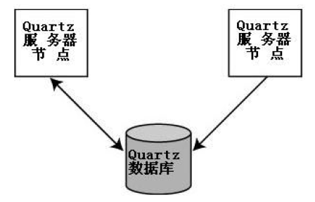
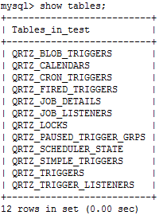
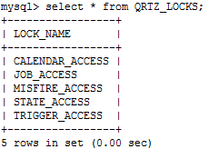
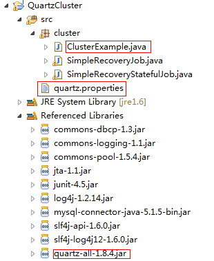
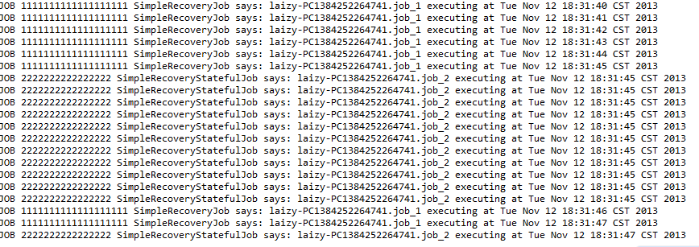

> 本文出处：https://www.cnblogs.com/zhenyuyaodidiao/p/4755649.html
# 1、Quartz任务调度的基本实现原理

　　Quartz是OpenSymphony开源组织在任务调度领域的一个开源项目，完全基于Java实现。作为一个优秀的开源调度框架，Quartz具有以下特点：

　　　　（1）强大的调度功能，例如支持丰富多样的调度方法，可以满足各种常规及特殊需求；

　　　　（2）灵活的应用方式，例如支持任务和调度的多种组合方式，支持调度数据的多种存储方式；

　　　　（3）分布式和集群能力，Terracotta收购后在原来功能基础上作了进一步提升。本文将对该部分相加阐述。

## 1.1 Quartz 核心元素

　　Quartz任务调度的核心元素为：Scheduler——任务调度器、Trigger——触发器、Job——任务。其中trigger和job是任务调度的元数据，scheduler是实际执行调度的控制器。

　　**Trigger**是用于定义调度时间的元素，即按照什么时间规则去执行任务。Quartz中主要提供了四种类型的trigger：SimpleTrigger，CronTirgger，DateIntervalTrigger，和NthIncludedDayTrigger。这四种trigger可以满足企业应用中的绝大部分需求。

　　**Job**用于表示被调度的任务。主要有两种类型的job：无状态的（stateless）和有状态的（stateful）。对于同一个trigger来说，有状态的job不能被并行执行，只有上一次触发的任务被执行完之后，才能触发下一次执行。Job主要有两种属性：volatility和durability，其中volatility表示任务是否被持久化到数据库存储，而durability表示在没有trigger关联的时候任务是否被保留。两者都是在值为true的时候任务被持久化或保留。一个job可以被多个trigger关联，但是一个trigger只能关联一个job。

　　**Scheduler**由scheduler工厂创建：DirectSchedulerFactory或者StdSchedulerFactory。第二种工厂StdSchedulerFactory使用较多，因为DirectSchedulerFactory使用起来不够方便，需要作许多详细的手工编码设置。Scheduler主要有三种：RemoteMBeanScheduler，RemoteScheduler和StdScheduler。

　　Quartz核心元素之间的关系如图1.1所示：


图1.1 核心元素关系图

## 1.2 Quartz 线程视图

　　在Quartz中，有两类线程，Scheduler调度线程和任务执行线程，其中任务执行线程通常使用一个线程池维护一组线程。


图1.2 Quartz线程视图

　　Scheduler调度线程主要有两个：执行常规调度的线程，和执行misfiredtrigger的线程。常规调度线程轮询存储的所有trigger，如果有需要触发的trigger，即到达了下一次触发的时间，则从任务执行线程池获取一个空闲线程，执行与该trigger关联的任务。Misfire线程是扫描所有的trigger，查看是否有misfiredtrigger，如果有的话根据misfire的策略分别处理(**fire now** OR **wait for the next fire**)。

## 1.3 Quartz Job数据存储

　　Quartz中的trigger和job需要存储下来才能被使用。Quartz中有两种存储方式：RAMJobStore,JobStoreSupport，其中RAMJobStore是将trigger和job存储在内存中，而JobStoreSupport是基于jdbc将trigger和job存储到数据库中。RAMJobStore的存取速度非常快，但是由于其在系统被停止后所有的数据都会丢失，所以在集群应用中，必须使用JobStoreSupport。

# 2、Quartz集群原理

## 2.1 Quartz 集群架构

　　一个Quartz集群中的每个节点是一个独立的Quartz应用，它又管理着其他的节点。这就意味着你必须对每个节点分别启动或停止。Quartz集群中，独立的Quartz节点并不与另一其的节点或是管理节点通信，而是通过相同的数据库表来感知到另一Quartz应用的，如图2.1所示。



图2.1 Quartz集群架构

## 2.2 Quartz集群相关数据库表

　　因为Quartz集群依赖于数据库，所以必须首先创建Quartz数据库表，Quartz发布包中包括了所有被支持的数据库平台的SQL脚本。这些SQL脚本存放于<quartz_home>/docs/dbTables 目录下。这里采用的Quartz 1.8.4版本，总共12张表，不同版本，表个数可能不同。数据库为mysql，用tables_mysql.sql创建数据库表。全部表如图2.2所示，对这些表的简要介绍如图2.3所示。



图2.2 Quartz 1.8.4在mysql数据库中生成的表


图2.3 Quartz数据表简介

### 2.2.1 调度器状态表（QRTZ_SCHEDULER_STATE）

　　**说明：**集群中节点实例信息，Quartz定时读取该表的信息判断集群中每个实例的当前状态。

　　**instance_name****：**配置文件中org.quartz.scheduler.instanceId配置的名字，如果设置为AUTO,quartz会根据物理机名和当前时间产生一个名字。

　　**last_checkin_time****：**上次检入时间

　　**checkin_interval****：**检入间隔时间

### 2.2.2 触发器与任务关联表（qrtz_fired_triggers）

　　存储与已触发的Trigger相关的状态信息，以及相联Job的执行信息。

### 2.2.3 触发器信息表（qrtz_triggers)

　　**trigger_name****：**trigger的名字,该名字用户自己可以随意定制,无强行要求

　　**trigger_group****：**trigger所属组的名字,该名字用户自己随意定制,无强行要求

　　**job_name****：**qrtz_job_details表job_name的外键

　　**job_group****：**qrtz_job_details表job_group的外键

　　**trigger_state****：**当前trigger状态设置为ACQUIRED,如果设为WAITING,则job不会触发

　　**trigger_cron****：**触发器类型,使用cron表达式

### 2.2.4 任务详细信息表（qrtz_job_details）

　　**说明：**保存job详细信息,该表需要用户根据实际情况初始化

　　**job_name****：**集群中job的名字,该名字用户自己可以随意定制,无强行要求。

　　**job_group****：**集群中job的所属组的名字,该名字用户自己随意定制,无强行要求。

　　**job_class_name****：**集群中job实现类的完全包名,quartz就是根据这个路径到classpath找到该job类的。

　　**is_durable****：**是否持久化,把该属性设置为1，quartz会把job持久化到数据库中

　　**job_data****：**一个blob字段，存放持久化job对象。

### 2.2.5权限信息表（qrtz_locks）

　　说明：tables_oracle.sql里有相应的dml初始化，如图2.4所示。



图2.4 Quartz权限信息表中的初始化信息

## 2.3 Quartz Scheduler在集群中的启动流程

　　Quartz Scheduler自身是察觉不到被集群的，只有配置给Scheduler的JDBC JobStore才知道。当Quartz Scheduler启动时，它调用JobStore的**schedulerStarted**()方法，它告诉JobStore Scheduler已经启动了。schedulerStarted() 方法是在**JobStoreSupport**类中实现的。JobStoreSupport类会根据**quartz.properties**文件中的设置来确定Scheduler实例是否参与到集群中。假如配置了集群，一个新的**ClusterManager**类的实例就被创建、初始化并启动。ClusterManager是在JobStoreSupport类中的一个内嵌类，继承了java.lang.Thread，它会定期运行，并对Scheduler实例执行检入的功能。Scheduler也要查看是否有任何一个别的集群节点失败了。检入操作执行周期在quartz.properties中配置。

## 2.4 侦测失败的Scheduler节点

　　当一个Scheduler实例执行检入时，它会查看是否有其他的Scheduler实例在到达他们所预期的时间还未检入。这是通过检查SCHEDULER_STATE表中Scheduler记录在LAST_CHEDK_TIME列的值是否早于org.quartz.jobStore.clusterCheckinInterval来确定的。如果一个或多个节点到了预定时间还没有检入，那么运行中的Scheduler就假定它(们) 失败了。

## 2.5 从故障实例中恢复Job

　　当一个Sheduler实例在执行某个Job时失败了，有可能由另一正常工作的Scheduler实例接过这个Job重新运行。要实现这种行为，配置给JobDetail对象的Job可恢复属性必须设置为true（job.setRequestsRecovery(true)）。如果可恢复属性被设置为false(默认为false)，当某个Scheduler在运行该job失败时，它将不会重新运行；而是由另一个Scheduler实例在下一次触发时间触发。Scheduler实例出现故障后多快能被侦测到取决于每个Scheduler的检入间隔（即2.3中提到的org.quartz.jobStore.clusterCheckinInterval）。

# 3、Quartz集群实例(Quartz+Spring)

## 3.1 Spring不兼容Quartz问题

　　Spring从2.0.2开始便不再支持Quartz。具体表现在 Quartz+Spring 把 Quartz 的 Task 实例化进入数据库时，会产生： Serializable 的错误：
```
<bean id="jobtask" class="org.springframework.scheduling.quartz. MethodInvokingJobDetailFactoryBean ">
　　<property name="targetObject">
　　　　<ref bean="quartzJob"/>
　　</property>
　　<property name="targetMethod">
　　　　<value>execute</value>
　　</property>
</bean>
```
　　这个 MethodInvokingJobDetailFactoryBean 类中的 methodInvoking 方法，是不支持序列化的，因此在把 QUARTZ 的 TASK 序列化进入数据库时就会抛错。

　　首先解决MethodInvokingJobDetailFactoryBean的问题，在不修改Spring源码的情况下，可以避免使用这个类，直接调用JobDetail。但是使用JobDetail实现，需要自己实现MothodInvoking的逻辑，可以使用JobDetail的jobClass和JobDataAsMap属性来自定义一个Factory(Manager)来实现同样的目的。例如，本示例中新建了一个MyDetailQuartzJobBean来实现这个功能。

## 3.2 MyDetailQuartzJobBean.java文件
```
package org.lxh.mvc.jobbean;

import java.lang.reflect.Method;
import org.apache.commons.logging.Log;
import org.apache.commons.logging.LogFactory;
import org.quartz.JobExecutionContext;
import org.quartz.JobExecutionException;
import org.springframework.context.ApplicationContext;
import org.springframework.scheduling.quartz.QuartzJobBean;

public class MyDetailQuartzJobBean extends QuartzJobBean {
    protected final Log logger = LogFactory.getLog(getClass());
    private String targetObject;
    private String targetMethod;
    private ApplicationContext ctx;
    protected void executeInternal(JobExecutionContext context) throws JobExecutionException {
        try {
            logger.info("execute [" + targetObject + "] at once>>>>>>");
            Object otargetObject = ctx.getBean(targetObject);
            Method m = null;
            try {
                m = otargetObject.getClass().getMethod(targetMethod, new Class[] {});
                m.invoke(otargetObject, new Object[] {});
            } catch (SecurityException e) {
                logger.error(e);
            } catch (NoSuchMethodException e) {
                logger.error(e);
            }
        } catch (Exception e) {
            throw new JobExecutionException(e);
        }
    }

    public void setApplicationContext(ApplicationContext applicationContext){
        this.ctx=applicationContext;
    }

    public void setTargetObject(String targetObject) {
        this.targetObject = targetObject;
    }

    public void setTargetMethod(String targetMethod) {
        this.targetMethod = targetMethod;
    }

}
```

## 3.3真正的Job实现类

　　在Test类中，只是简单实现了打印系统当前时间的功能。
```
package org.lxh.mvc.job;
import java.io.Serializable;
import java.util.Date;

import org.apache.commons.logging.Log;
import org.apache.commons.logging.LogFactory;

public class Test implements Serializable{
    private Log logger = LogFactory.getLog(Test.class);
    private static final long serialVersionUID = -2073310586499744415L;  
    public void execute () {
        Date date=new Date();  
        System.out.println(date.toLocaleString());  
    }
    
}
```
## 3.4 配置quartz.xml文件
```
<bean id="Test" class="org.lxh.mvc.job.Test" scope="prototype">
    </bean>

    <bean id="TestjobTask" class="org.springframework.scheduling.quartz.JobDetailBean">
        <property name="jobClass">
            <value>org.lxh.mvc.jobbean.MyDetailQuartzJobBean</value>
        </property>
        <property name="jobDataAsMap">
            <map>
                <entry key="targetObject" value="Test" />
                <entry key="targetMethod" value="execute" />
             </map>
         </property> 
     </bean>
    
    <bean name="TestTrigger" class="org.springframework.scheduling.quartz.CronTriggerBean">  
        <property name="jobDetail" ref="TestjobTask" />
        <property name="cronExpression" value="0/1 * * * * ?" />
    </bean> 
    
<bean id="quartzScheduler"
    class="org.springframework.scheduling.quartz.SchedulerFactoryBean">
        <property name="configLocation" value="classpath:quartz.properties"/>
        <property name="triggers">
            <list>
                <ref bean="TestTrigger" />
            </list>
        </property>
        <property name="applicationContextSchedulerContextKey" value="applicationContext" />
    </bean>        
```
## 3.5 测试

　　ServerA、ServerB的代码、配置完全一样，先启动ServerA，后启动ServerB，当Server关断之后，ServerB会监测到其关闭，并将ServerA上正在执行的Job接管，继续执行。

# 4、Quartz集群实例（单独Quartz）

　　尽管我们已经实现了Spring+Quartz的集群配置，但是因为Spring与Quartz之间的兼容问题还是不建议使用该方式。在本小节中，我们实现了单独用Quartz配置的集群，相对Spring+Quartz的方式来说，简单、稳定。

## 4.1 工程结构

　　我们采用单独使用Quartz来实现其集群功能，代码结构及所需的第三方jar包如图3.1所示。其中，Mysql版本：5.1.52，Mysql驱动版本：mysql-connector-java-5.1.5-bin.jar（针对于5.1.52，建议采用该版本驱动，因为Quartz存在BUG使得其与某些Mysql驱动结合时不能正常运行）。

 

图4.1 Quartz集群工程结构及所需第三方jar包

　　其中quartz.properties为Quartz配置文件，放在src目录下，若无该文件，Quartz将自动加载jar包中的quartz.properties文件；SimpleRecoveryJob.java、SimpleRecoveryStatefulJob.java为两个Job；ClusterExample.java中编写了调度信息、触发机制及相应的测试main函数。

## 4.2 配置文件quartz.properties

　　默认文件名称quartz.properties，通过设置"org.quartz.jobStore.isClustered"属性为"true"来激活集群特性。在集群中的每一个实例都必须有一个唯一的"instance id" ("org.quartz.scheduler.instanceId" 属性), 但是应该有相同的"scheduler instance name" ("org.quartz.scheduler.instanceName")，也就是说集群中的每一个实例都必须使用相同的quartz.properties 配置文件。除了以下几种例外，配置文件的内容其他都必须相同：

　　a.线程池大小。

　　b.不同的"org.quartz.scheduler.instanceId"属性值（通过设定为"AUTO"即可）。
```
#==============================================================  
#Configure Main Scheduler Properties  
#==============================================================   
org.quartz.scheduler.instanceName = quartzScheduler
org.quartz.scheduler.instanceId = AUTO

#==============================================================  
#Configure JobStore  
#============================================================== 
org.quartz.jobStore.class = org.quartz.impl.jdbcjobstore.JobStoreTX
org.quartz.jobStore.driverDelegateClass = org.quartz.impl.jdbcjobstore.StdJDBCDelegate
org.quartz.jobStore.tablePrefix = QRTZ_
org.quartz.jobStore.isClustered = true
org.quartz.jobStore.clusterCheckinInterval = 10000  
org.quartz.jobStore.dataSource = myDS
 
#==============================================================  
#Configure DataSource  
#============================================================== 
org.quartz.dataSource.myDS.driver = com.mysql.jdbc.Driver
org.quartz.dataSource.myDS.URL = jdbc:mysql://192.168.31.18:3306/test?useUnicode=true&amp;characterEncoding=UTF-8
org.quartz.dataSource.myDS.user = root
org.quartz.dataSource.myDS.password = 123456
org.quartz.dataSource.myDS.maxConnections = 30

#==============================================================  
#Configure ThreadPool  
#============================================================== 
org.quartz.threadPool.class = org.quartz.simpl.SimpleThreadPool
org.quartz.threadPool.threadCount = 5
org.quartz.threadPool.threadPriority = 5
org.quartz.threadPool.threadsInheritContextClassLoaderOfInitializingThread = true
```
## 4.3 ClusterExample.java文件
```
package cluster;
import java.util.Date;
import org.quartz.JobDetail;
import org.quartz.Scheduler;
import org.quartz.SchedulerFactory;
import org.quartz.SimpleTrigger;
import org.quartz.impl.StdSchedulerFactory;
public class ClusterExample {
   
    public void cleanUp(Scheduler inScheduler) throws Exception {
        System.out.println("***** Deleting existing jobs/triggers *****");
        // unschedule jobs
        String[] groups = inScheduler.getTriggerGroupNames();
        for (int i = 0; i < groups.length; i++) {
            String[] names = inScheduler.getTriggerNames(groups[i]);
            for (int j = 0; j < names.length; j++) {
                inScheduler.unscheduleJob(names[j], groups[i]);
            }
        }
        // delete jobs
        groups = inScheduler.getJobGroupNames();
        for (int i = 0; i < groups.length; i++) {
            String[] names = inScheduler.getJobNames(groups[i]);
            for (int j = 0; j < names.length; j++) {
                inScheduler.deleteJob(names[j], groups[i]);
            }
        }
    }
       
    public void run(boolean inClearJobs, boolean inScheduleJobs) 
        throws Exception {
        // First we must get a reference to a scheduler
        SchedulerFactory sf = new StdSchedulerFactory();
        Scheduler sched = sf.getScheduler();
       
        if (inClearJobs) {
            cleanUp(sched);
        }
        System.out.println("------- Initialization Complete -----------");
        if (inScheduleJobs) {
            System.out.println("------- Scheduling Jobs ------------------");
            String schedId = sched.getSchedulerInstanceId();
            int count = 1;
            JobDetail job = new JobDetail("job_" + count, schedId, SimpleRecoveryJob.class);
            // ask scheduler to re-execute this job if it was in progress when
            // the scheduler went down...
            job.setRequestsRecovery(true);
            SimpleTrigger trigger = 
                new SimpleTrigger("triger_" + count, schedId, 200, 1000L);
            trigger.setStartTime(new Date(System.currentTimeMillis() + 1000L));
            System.out.println(job.getFullName() +
                    " will run at: " + trigger.getNextFireTime() +  
                    " and repeat: " + trigger.getRepeatCount() + 
                    " times, every " + trigger.getRepeatInterval() / 1000 + " seconds");
            sched.scheduleJob(job, trigger);
            count++;
            job = new JobDetail("job_" + count, schedId, 
                    SimpleRecoveryStatefulJob.class);
            // ask scheduler to re-execute this job if it was in progress when
            // the scheduler went down...
            job.setRequestsRecovery(false);
            trigger = new SimpleTrigger("trig_" + count, schedId, 100, 2000L);
            trigger.setStartTime(new Date(System.currentTimeMillis() + 2000L));
            System.out.println(job.getFullName() +
                    " will run at: " + trigger.getNextFireTime() +  
                    " and repeat: " + trigger.getRepeatCount() + 
                    " times, every " + trigger.getRepeatInterval() / 1000 + " seconds");
            sched.scheduleJob(job, trigger);
        }
        // jobs don't start firing until start() has been called...
        System.out.println("------- Starting Scheduler ---------------");
        sched.start();
        System.out.println("------- Started Scheduler ----------------");
        System.out.println("------- Waiting for one hour... ----------");
        try {
            Thread.sleep(3600L * 1000L);
        } catch (Exception e) {
        }
        System.out.println("------- Shutting Down --------------------");
        sched.shutdown();
        System.out.println("------- Shutdown Complete ----------------");
        }
   
    public static void main(String[] args) throws Exception {
        boolean clearJobs = true;
        boolean scheduleJobs = true;
        for (int i = 0; i < args.length; i++) {
            if (args[i].equalsIgnoreCase("clearJobs")) {
                clearJobs = true;                
            } else if (args[i].equalsIgnoreCase("dontScheduleJobs")) {
                scheduleJobs = false;
            }
        }
        ClusterExample example = new ClusterExample();
        example.run(clearJobs, scheduleJobs);
    }
}
```
## 4.4 SimpleRecoveryJob.java
```
package cluster;

import java.io.Serializable;
import java.util.Date;
import org.apache.commons.logging.Log;
import org.apache.commons.logging.LogFactory;
import org.quartz.Job;
import org.quartz.JobExecutionContext;
import org.quartz.JobExecutionException;
//如果有想反复执行的动作，作业，任务就把相关的代码写在execute这个方法里，前提：实现Job这个接口
//至于SimpleJob这个类什么时候实例化，execute这个方法何时被调用，我们不用关注，交给Quartz
public class SimpleRecoveryJob implements Job, Serializable {
    private static Log _log = LogFactory.getLog(SimpleRecoveryJob.class);
    public SimpleRecoveryJob() {
    }
    public void execute(JobExecutionContext context)
        throws JobExecutionException {
     //这个作业只是简单的打印出作业名字和此作业运行的时间
        String jobName = context.getJobDetail().getFullName();
        System.out.println("JOB 1111111111111111111 SimpleRecoveryJob says: " + jobName + " executing at " + new Date());
    }
}
```
## 4.5 运行结果

　　Server A与Server B中的配置和代码完全一样。运行方法：运行任意主机上的ClusterExample.java，将任务加入调度，观察运行结果：

　　运行ServerA，结果如图4.2所示。


图4.2 ServerA运行结果1

　　

　　开启ServerB后，ServerA与ServerB的输出如图4.3、4.4所示。


图4.3 ServerA运行结果2

 


图4.4 ServerB运行结果1

　　从图4.3、4.4可以看出，ServerB开启后，系统自动实现了负责均衡，ServerB接手Job1。关断ServerA后，ServerB的运行结果如图4.5所示。



图4.5 ServerB运行结果2

　　从图4.5中可以看出，ServerB可以检测出ServerA丢失，将其负责的任务Job2接手，并将ServerA丢失到Server检测出这段异常时间中需要执行的Job2重新执行了。

# 5、注意事项

## 5.1 时间同步问题

　　Quartz实际并不关心你是在相同还是不同的机器上运行节点。当集群放置在不同的机器上时，称之为水平集群。节点跑在同一台机器上时，称之为垂直集群。对于垂直集群，存在着单点故障的问题。这对高可用性的应用来说是无法接受的，因为一旦机器崩溃了，所有的节点也就被终止了。对于水平集群，存在着时间同步问题。

　　节点用时间戳来通知其他实例它自己的最后检入时间。假如节点的时钟被设置为将来的时间，那么运行中的Scheduler将再也意识不到那个结点已经宕掉了。另一方面，如果某个节点的时钟被设置为过去的时间，也许另一节点就会认定那个节点已宕掉并试图接过它的Job重运行。最简单的同步计算机时钟的方式是使用某一个Internet时间服务器(Internet Time Server ITS)。

## 5.2 节点争抢Job问题

　　因为Quartz使用了一个随机的负载均衡算法， Job以随机的方式由不同的实例执行。Quartz官网上提到当前，还不存在一个方法来指派(钉住) 一个 Job 到集群中特定的节点。

## 5.3 从集群获取Job列表问题

　　当前，如果不直接进到数据库查询的话，还没有一个简单的方式来得到集群中所有正在执行的Job列表。请求一个Scheduler实例，将只能得到在那个实例上正运行Job的列表。Quartz官网建议可以通过写一些访问数据库JDBC代码来从相应的表中获取全部的Job信息。
